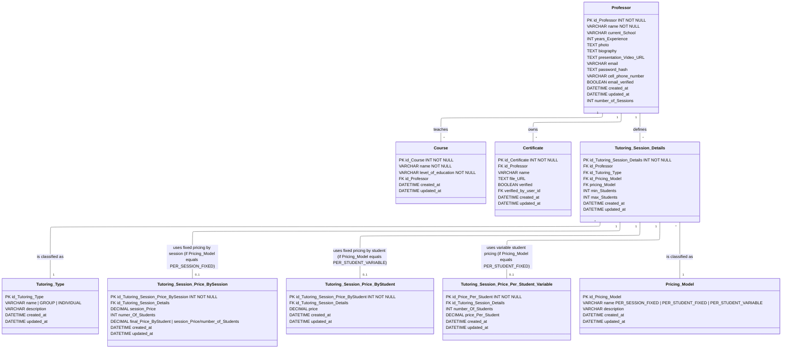

```mermaid
---
config:
  layout: elk
---
classDiagram

    class Professor{
        PK id_Professor INT NOT NULL
        VARCHAR name NOT NULL
        VARCHAR current_School
        INT years_Experience
        TEXT photo
        TEXT biography
        TEXT presentation_Video_URL
        VARCHAR email
        TEXT password_hash
        VARCHAR cell_phone_number
        BOOLEAN email_verified
        DATETIME created_at
        DATETIME updated_at
        INT number_of_Sessions
    }

    class Course{
        PK id_Course INT NOT NULL
        VARCHAR name NOT NULL
        VARCHAR level_of_education NOT NULL
        FK id_Professor
        DATETIME created_at
        DATETIME updated_at
    }

    class Certificate{
        PK id_Certificate INT NOT NULL
        FK id_Professor
        VARCHAR name
        TEXT file_URL
        BOOLEAN verified
        FK verified_by_user_id
        DATETIME created_at
        DATETIME updated_at
    }

    class Tutoring_Type{
        PK id_Tutoring_Type
        VARCHAR name | GROUP | INDIVIDUAL
        VARCHAR description
        DATETIME created_at
        DATETIME updated_at
    }

    class Tutoring_Session_Details{
        PK id_Tutoring_Session_Details INT NOT NULL
        FK id_Professor
        FK id_Tutoring_Type
        FK id_Pricing_Model
        FK pricing_Model
        INT min_Students
        INT max_Students
        DATETIME created_at
        DATETIME updated_at
    }

    %% class Tutoring_Session{
    %%     PK id_Tutoring_Session INT NOT NULL
    %%     FK id_Tutoring_Session_Details
    %%     DATETIME created_at
    %%     DATETIME updated_at
    %% }

    %% class Schedule{
    %%     PK id_Schedule INT NOT NULL
    %%     FK id_Tutoring_Session
    %%     DATETIME start_time
    %%     DATETIME end_time
    %%     BOOLEAN recurring
    %% }

    class Tutoring_Session_Price_BySession{
        PK id_Tutoring_Session_Price_BySession INT NOT NULL
        FK id_Tutoring_Session_Details
        DECIMAL session_Price
        INT numer_Of_Students
        DECIMAL final_Price_ByStudent | session_Price/number_of_Students
        DATETIME created_at
        DATETIME updated_at
    }

    class Tutoring_Session_Price_ByStudent{
        PK id_Tutoring_Session_Price_ByStudent INT NOT NULL
        FK id_Tutoring_Session_Details
        DECIMAL price
        DATETIME created_at
        DATETIME updated_at
    }

    class Tutoring_Session_Price_Per_Student_Variable{
        PK id_Price_Per_Student INT NOT NULL
        FK id_Tutoring_Session_Details
        INT number_Of_Students
        DECIMAL price_Per_Student
        DATETIME created_at
        DATETIME updated_at
    }

    class Pricing_Model{
        PK id_Pricing_Model
        VARCHAR name PER_SESSION_FIXED | PER_STUDENT_FIXED | PER_STUDENT_VARIABLE
        VARCHAR description
        DATETIME created_at
        DATETIME updated_at
    }


    Professor "1" -- "*" Course : teaches
    Professor "1" -- "*" Certificate : owns
    Professor "1" -- "*" Tutoring_Session_Details : defines
    Tutoring_Session_Details "*" -- "1" Tutoring_Type : is classified as
    %% Tutoring_Session_Details "1" -- "*" Tutoring_Session : generates
    %% Tutoring_Session "1" -- "1" Schedule : is scheduled in

    Tutoring_Session_Details "1" -- "0..1" Tutoring_Session_Price_BySession : uses fixed pricing by session (if Pricing_Model equals PER_SESSION_FIXED)

    Tutoring_Session_Details "1" -- "0..1" Tutoring_Session_Price_Per_Student_Variable : uses variable student pricing (if Pricing_Model equals PER_STUDENT_FIXED)

    Tutoring_Session_Details "1" -- "0..1" Tutoring_Session_Price_ByStudent : uses fixed pricing by student (if Pricing_Model equals PER_STUDENT_VARIABLE)
    
    Tutoring_Session_Details "*" -- "1" Pricing_Model : is classified as


```