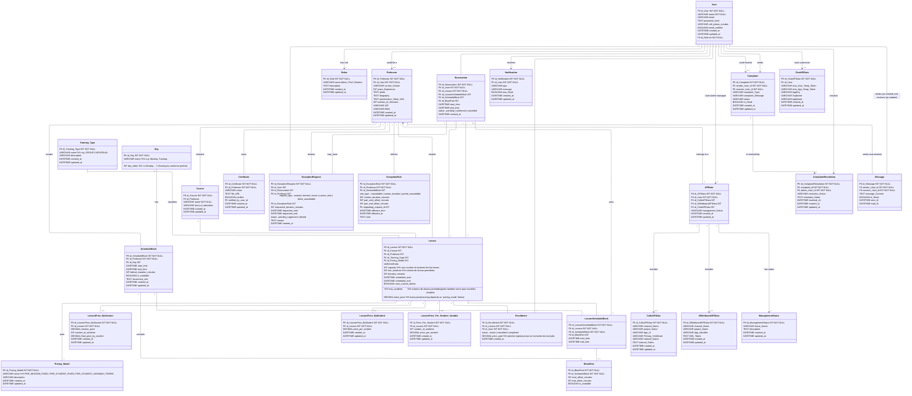

```mermaid
---
config :
    layout : elk 
---

classDiagram
    %% Classes principais
    %% class Professor{
    %%     PK id_Professor INT NOT NULL
    %%     VARCHAR name NOT NULL
    %%     VARCHAR current_School
    %%     INT years_Experience
    %%     TEXT photo
    %%     TEXT biography
    %%     TEXT presentation_Video_URL
    %%     VARCHAR email
    %%     TEXT password_hash
    %%     VARCHAR cell_phone_number
    %%     BOOLEAN email_verified
    %%     DATETIME created_at
    %%     DATETIME updated_at
    %%     INT number_of_Sessions
    %% }

    %% class Student{
    %%     PK id_Student INT NOT NULL
    %%     VARCHAR name NOT NULL
    %%     VARCHAR email
    %%     TEXT password_hash
    %%     VARCHAR cell_phone_number
    %%     BOOLEAN email_verified
    %%     DATETIME created_at
    %%     DATETIME updated_at
    %% }


    class User {
	    PK id_User INT NOT NULL
	    VARCHAR name NOT NULL
	    VARCHAR email
	    TEXT password_hash
	    VARCHAR cell_phone_number
	    BOOLEAN email_verified
	    DATETIME created_at
	    DATETIME updated_at
	    FK id_Role int NOT NULL
    }

    class Roles {
	    PK id_Role INT NOT NULL
	    VARCHAR name Admin | Prof | Student
	    TEXT description
	    DATETIME created_at
	    DATETIME updated_at
    }

    class Professor {
	    PK id_Professor INT NOT NULL
	    FK id_User INT NOT NULL
	    VARCHAR current_School
	    INT years_Experience
	    TEXT photo
	    TEXT biography
	    TEXT presentation_Video_URL
	    INT number_of_Sessions
	    VARCHAR VAT
	    VARCHAR IBAN
	    DATETIME created_at
	    DATETIME updated_at
    }

    class Course{
        PK id_Course INT NOT NULL
        FK id_Professor
        VARCHAR name NOT NULL
        VARCHAR level_of_education
        DATETIME created_at
        DATETIME updated_at
    }

    class Certificate{
        PK id_Certificate INT NOT NULL
        FK id_Professor INT NOT NULL
        VARCHAR name
        TEXT file_URL
        BOOLEAN verified
        FK verified_by_user_id
        DATETIME created_at
        DATETIME updated_at
    }

    class Tutoring_Type{
        PK id_Tutoring_Type INT NOT NULL
        VARCHAR name    %% e.g. GROUP | INDIVIDUAL
        VARCHAR description
        DATETIME created_at
        DATETIME updated_at
    }

    %% Modelo de pricing herdado do primeiro diagrama
    class Pricing_Model{
        PK id_Pricing_Model INT NOT NULL
        VARCHAR name       %% PER_SESSION_FIXED | PER_STUDENT_FIXED | PER_STUDENT_VARIABLE | TIERED
        VARCHAR description
        DATETIME created_at
        DATETIME updated_at
    }

    %% Dias da semana para ligar aos blocos
    class Day{
        PK id_Day INT NOT NULL
        VARCHAR name        %% e.g. Monday, Tuesday
        INT day_index        %% 1=Monday .. 7=Sunday (ou conforme preferir)
    }

    %% Agendamento: blocos de horário que o professor cria
    class ScheduleBlock{
        PK id_ScheduleBlock INT NOT NULL
        FK id_Professor INT NOT NULL
        FK id_Day INT
        DATETIME start_time
        DATETIME end_time
        INT default_duration_minutes
        BOOLEAN is_available
        TEXT recurrence_rule
        DATETIME created_at
        DATETIME updated_at
    }

    %% Partes de bloco (para permitir disponibilidade parcial dentro de um bloco)
    class BlockPart{
        PK id_BlockPart INT NOT NULL
        FK id_ScheduleBlock INT NOT NULL
        INT start_offset_minutes
        INT end_offset_minutes
        BOOLEAN is_available
    }

    %% Aulas/tutoring sessions que usam blocos ou tempos específicos
    class Lesson{
        PK id_Lesson INT NOT NULL
        FK id_Course INT
        FK id_Professor INT
        FK id_Tutoring_Type INT
        FK id_Pricing_Model INT
        VARCHAR title
        INT capacity            %% max number of students for this lesson
        INT min_students        %% mínimo de alunos permitidos
        INT max_students        %% máximo de alunos permitidos (pode também servir para escalões simples)
        DECIMAL base_price      %% base price (meaning depends on `pricing_mode` below)
        %% `pricing_mode` now represented by `id_Pricing_Model`
        INT duration_minutes
        DATETIME scheduled_start
        DATETIME scheduled_end
        BOOLEAN uses_custom_blocks
    }

    %% (Removida) PriceTier: escalões agora simplificados usando campos em `Lesson`.

    %% Preços por várias estratégias (modelo do primeiro diagrama)
    class LessonPrice_BySession{
        PK id_LessonPrice_BySession INT NOT NULL
        FK id_Lesson INT NOT NULL
        DECIMAL session_price
        INT number_of_students
        DECIMAL final_price_by_student
        DATETIME created_at
        DATETIME updated_at
    }

    class LessonPrice_ByStudent{
        PK id_LessonPrice_ByStudent INT NOT NULL
        FK id_Lesson INT NOT NULL
        DECIMAL price_per_student
        DATETIME created_at
        DATETIME updated_at
    }

    class LessonPrice_Per_Student_Variable{
        PK id_Price_Per_Student INT NOT NULL
        FK id_Lesson INT NOT NULL
        INT number_of_students
        DECIMAL price_per_student
        DATETIME created_at
        DATETIME updated_at
    }

    %% Matrículas/participação de alunos em Lessons (many-to-many)
    class Enrollment{
        PK id_Enrollment INT NOT NULL
        FK id_Lesson INT NOT NULL
        FK id_User INT NOT NULL
        status : active | cancelled | completed
        DECIMAL price_paid    %% permite registar preço no momento da inscrição
        DATETIME created_at
    }

    %% Junção: permite ligar uma Lesson a vários ScheduleBlocks/BlockParts
    class LessonScheduleBlock{
        PK id_LessonScheduleBlock INT NOT NULL
        FK id_Lesson INT NOT NULL
        FK id_ScheduleBlock INT NOT NULL
        FK id_BlockPart INT
        DATETIME start_time
        DATETIME end_time
    }

    %% Reservas feitas por alunos
    class Reservation{
        PK id_Reservation INT NOT NULL
        FK id_User INT NOT NULL
        FK id_Lesson INT NOT NULL
        FK id_LessonScheduleBlock INT
        FK id_ScheduleBlock INT
        FK id_BlockPart INT
        DATETIME start_time
        DATETIME end_time
        status : pending | confirmed | cancelled
        DATETIME created_at
    }

    %% Pedidos de exceção feitos pelos alunos (ou pelo próprio professor em nome do aluno)
    class ExceptionRequest{
        PK id_ExceptionRequest INT NOT NULL
        FK id_User INT
        FK id_Reservation INT
        FK id_Professor INT
        request_type : extend | shorten | move | custom_time | block_unavailable
        FK id_ExceptionRule INT
        INT requested_duration_minutes
        DATETIME requested_start
        DATETIME requested_end
        status : pending | approved | denied
        TEXT reason
        DATETIME created_at
    }

    %% Regras/exceções definidas pelo professor (aplicáveis a blocos ou globalmente)
    class ExceptionRule{
        PK id_ExceptionRule INT NOT NULL
        FK id_Professor INT NOT NULL
        FK id_ScheduleBlock INT
        rule_type : unavailable | custom_duration | partial_unavailable
        INT custom_duration_minutes
        INT part_start_offset_minutes
        INT part_end_offset_minutes
        FK originating_request_id INT
        DATETIME effective_from
        DATETIME effective_to
        TEXT note
    }


    class Notification {
	    PK id_Notification INT NOT NULL
	    FK id_User INT NOT NULL
	    VARCHAR type
	    VARCHAR message
	    BOOLEAN was_Read
	    DATETIME created_at
	    DATETIME updated_at
    }

    class Complaint {
	    PK id_Complaint INT NOT NULL
	    FK sender_User_Id INT NOT NULL
	    FK receiver_User_Id INT NULL
	    VARCHAR complaint_Type
	    VARCHAR complaint_Message
        VARCHAR status
	    BOOLEAN is_Read
	    DATETIME created_at
	    DATETIME updated_at
    }

    class CallsAPIData {
	    PK id_CallsAPIData INT NOT NULL
	    VARCHAR channel_Name
	    VARCHAR project_Name
	    VARCHAR App_Id
	    VARCHAR Primary_Certificate
	    VARCHAR channel_Name
	    TEXT channel_Token
	    DATETIME created_at
	    DATETIME updated_at
    }

    class WhiteboardAPIData {
	    PK id_WhiteboardAPIData INT NOT NULL
	    VARCHAR channel_Name
	    VARCHAR project_Name
	    VARCHAR App_Identifier
	    TEXT SDK_Token
	    DATETIME created_at
	    DATETIME updated_at
    }

    class ChatAPIData {
	    PK id_ChatAPIData INT NOT NULL
	    FK id_User 
	    VARCHAR chat_User_Temp_Token
	    VARCHAR chat_App_Temp_Token
	    VARCHAR AppKey
	    VARCHAR OrgName
	    VARCHAR AppName
	    DATETIME created_at
	    DATETIME updated_at
    }

    class APIData {
	    PK id_APIData INT NOT NULL
	    FK id_User INT NOT NULL
	    FK id_CallsAPIData INT
	    FK id_WhiteboardAPIData INT
	    FK id_ChatAPIData INT
	    VARCHAR management_Status
	    DATETIME created_at
	    DATETIME updated_at
    }

    class ManagementStatus {
	    PK id_ManagementStatus INT NOT NULL
	    VARCHAR status_Name
	    TEXT description
	    DATETIME created_at
	    DATETIME updated_at
    }

    class ComplaintResolution {
	    PK id_ComplaintResolution INT NOT NULL
	    FK complaint_Id INT NOT NULL
	    FK admin_User_Id INT NOT NULL
	    VARCHAR resolution_Status
	    TEXT resolution_Notes
	    DATETIME resolved_At
	    DATETIME created_at
	    DATETIME updated_at
    }

    class Message {
        PK id_Message INT NOT NULL
        FK sender_User_Id INT NOT NULL
        FK receiver_User_Id INT NOT NULL
        TEXT message_Content
        BOOLEAN is_Read
        DATETIME sent_At
        DATETIME read_At
    }

    User "1" --> "1" Roles : has role
    User "1" --> "0..1" Professor : could be a
    User "1" --> "*" Notification : receives
    User "1" --> "*" Complaint : sends
    User "1" --> "0..1" Complaint : could receive
    Complaint "1" --> "0..1" ComplaintResolution : is resolved by
    User "1" --> "*" ComplaintResolution : resolves
    User "1" --> "1" APIData : User Admin manages
    APIData "1" --> "0..1" CallsAPIData : includes
    APIData "1" --> "0..1" WhiteboardAPIData : includes
    User "1" --> "0..1" ChatAPIData : have a personal
    APIData "1" --> "1" ManagementStatus : has status
    Professor "1" <-- "1" APIData : belongs to a
    Professor "1" -- "*" Message : sends and receives
    User "1" -- "*" Message : sends (as student) and receives (as student)

    %% Relações
    Professor "1" -- "*" Course : contains
    Professor "1" -- "*" Certificate : owns
    Professor "1" -- "*" ScheduleBlock : creates
    Day "1" -- "*" ScheduleBlock : has
    ScheduleBlock "1" -- "*" BlockPart : contains
    Professor "1" -- "*" ExceptionRule : defines
    Professor "1" -- "*" Lesson : creates
    Course "1" -- "*" Lesson
    Tutoring_Type "1" -- "*" Lesson : classifies
    Lesson "1" -- "*" Reservation
    User "1" -- "*" Reservation
    Reservation "*" -- "1" Lesson
    Reservation "1" -- "*" ExceptionRequest : may_have
    User "1" -- "*" ExceptionRequest
    Professor "1" -- "*" ExceptionRequest : reviews
    Lesson "1" -- "*" LessonScheduleBlock
    ScheduleBlock "1" -- "*" LessonScheduleBlock
    LessonScheduleBlock "*" -- "0..1" BlockPart
    Reservation "0..1" -- "1" LessonScheduleBlock : uses
    Lesson "1" -- "*" Enrollment
    User "1" -- "*" Enrollment
    Lesson "1" -- "0..1" LessonPrice_BySession
    Lesson "1" -- "0..1" LessonPrice_ByStudent
    Lesson "1" -- "0..1" LessonPrice_Per_Student_Variable
    Lesson "*" -- "1" Pricing_Model : uses

    %% Notas funcionais
    %% - `ScheduleBlock` representa blocos de horário criados pelo professor.
    %% - `BlockPart` permite marcar sub-intervalos dentro de um bloco como indisponíveis ou com duração diferente.
    %% - `ExceptionRequest` são pedidos dos alunos para alterar tempo/posição da aula; o professor aprova/nega e pode transformar em `ExceptionRule`.
    %% - Pricing semantics (como calcular o preço a cobrar):
    %%   * `pricing_mode = fixed` → `Lesson.base_price` é o PREÇO TOTAL da aula (independente do número de participantes).
    %%   * `pricing_mode = per_person` → `Lesson.base_price` é o PREÇO POR PESSOA.
    %%   * `pricing_mode = tiered` → usar linhas em `PriceTier` para definir escalões por número de participantes:
    %%       - cada `PriceTier` aplica-se quando `min_students <= n_students <= max_students`.
    %%       - usar `price_per_student` (ou `price_total`) para calcular `Enrollment.price_paid`.
    %%   * Recomenda-se: ao efetuar checkout, calcular o preço com base no `pricing_mode` e gravar o valor final em `Enrollment.price_paid`.
```
