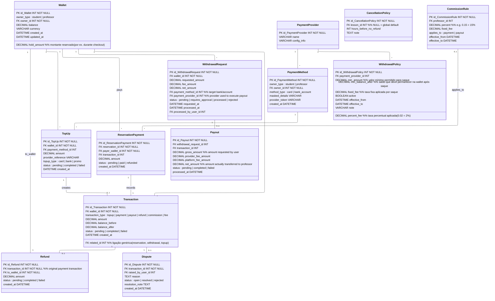

```mermaid
---
config:
  layout: elk
---
classDiagram

    %% Wallets e movimentos financeiros
    class Wallet{
        PK id_Wallet INT NOT NULL
        owner_type : student | professor
        FK owner_id INT NOT NULL
        DECIMAL balance
        DECIMAL hold_amount    %% montante reservado (por ex. durante checkout)
        VARCHAR currency
        DATETIME created_at
        DATETIME updated_at
    }

    class Transaction{
        PK id_Transaction INT NOT NULL
        FK wallet_id INT NOT NULL
        transaction_type : topup | payment | payout | refund | commission | fee
        DECIMAL amount
        DECIMAL balance_before
        DECIMAL balance_after
        FK related_id INT       %% ligação genérica (reservation, withdrawal, topup)
        status : pending | completed | failed
        DATETIME created_at
    }

    class TopUp{
        PK id_TopUp INT NOT NULL
        FK wallet_id INT NOT NULL
        FK payment_method_id INT
        DECIMAL amount
        provider_reference VARCHAR
        topup_type : card | bank | promo
        status : pending | completed | failed
        DATETIME created_at
    }

    class WithdrawalRequest{
        PK id_WithdrawalRequest INT NOT NULL
        FK wallet_id INT NOT NULL
        DECIMAL requested_amount
        DECIMAL fee_amount
        DECIMAL net_amount
        FK payment_method_id INT    %% target bank/account
        FK payment_provider_id INT  %% provider used to execute payout
        status : pending | requires_approval | processed | rejected
        DATETIME requested_at
        DATETIME processed_at
        FK processed_by_user_id INT
    }

    class PaymentMethod{
        PK id_PaymentMethod INT NOT NULL
        owner_type : student | professor
        FK owner_id INT NOT NULL
        method_type : card | bank_account
        masked_details VARCHAR
        provider_token VARCHAR
        created_at DATETIME
    }

    class PaymentProvider{
        PK id_PaymentProvider INT NOT NULL
        VARCHAR name
        VARCHAR config_info
    }

    class ReservationPayment{
        PK id_ReservationPayment INT NOT NULL
        FK reservation_id INT NOT NULL
        FK payer_wallet_id INT NOT NULL
        FK transaction_id INT
        DECIMAL amount
        status : pending | paid | refunded
        created_at DATETIME
    }

    class Payout{
        PK id_Payout INT NOT NULL
        FK withdrawal_request_id INT
        FK transaction_id INT
        DECIMAL gross_amount    %% amount requested by user
        DECIMAL provider_fee_amount
        DECIMAL platform_fee_amount
        DECIMAL net_amount      %% amount actually transferred to professor
        status : pending | completed | failed
        processed_at DATETIME
    }

    %% Política de levantamentos / regras (mínimos, fees, saldos residuais)
    class WithdrawalPolicy{
        PK id_WithdrawalPolicy INT NOT NULL
        FK payment_provider_id INT
        DECIMAL min_amount        %% valor mínimo permitido para saque
        DECIMAL min_balance_after %% saldo que deve permanecer na wallet após saque
        DECIMAL fixed_fee         %% taxa fixa aplicada por saque
        DECIMAL percent_fee       %% taxa percentual aplicada (0.02 = 2%)
        BOOLEAN active
        DATETIME effective_from
        DATETIME effective_to
        VARCHAR note
    }

    class CancellationPolicy{
        PK id_CancellationPolicy INT NOT NULL
        FK lesson_id INT        %% NULL = global default
        INT hours_before_no_refund
        TEXT note
    }

    class CommissionRule{
        PK id_CommissionRule INT NOT NULL
        FK professor_id INT
        DECIMAL percent   %% e.g. 0.15 = 15%
        DECIMAL fixed_fee
        applies_to : payment | payout
        effective_from DATETIME
        effective_to DATETIME
    }

    class Refund{
        PK id_Refund INT NOT NULL
        FK transaction_id INT NOT NULL    %% original payment transaction
        FK to_wallet_id INT NOT NULL
        DECIMAL amount
        status : pending | completed | failed
        created_at DATETIME
    }

    class Dispute{
        PK id_Dispute INT NOT NULL
        FK transaction_id INT NOT NULL
        FK raised_by_user_id INT
        TEXT reason
        status : open | resolved | rejected
        resolution_note TEXT
        created_at DATETIME
    }

    %% Relações principais
    Wallet "1" -- "*" Transaction
    Wallet "1" -- "*" TopUp
    Wallet "1" -- "*" WithdrawalRequest
    PaymentProvider "1" -- "*" WithdrawalPolicy
    Wallet "1" -- "*" ReservationPayment : pays
    PaymentMethod "1" -- "*" TopUp
    PaymentProvider "1" -- "*" PaymentMethod
    Transaction "1" -- "0..1" Refund
    Transaction "1" -- "0..1" Dispute
    ReservationPayment "1" -- "1" Transaction : records
    WithdrawalRequest "1" -- "0..1" Payout

    %% Tie refunds/disputes/topups explicitly to payment primitives
    Refund "1" -- "1" Wallet : to_wallet
    TopUp "1" -- "0..1" Transaction : creates
    CommissionRule "0..1" -- "*" ReservationPayment : applies_to
    %%PaymentMethod "1" -- "1" User : owner    %% note: `User` is not declared in this file

    %% Notas / regras operacionais
    %% - Alunos fazem TopUp (card/bank) → cria TopUp + Transaction creditando `Wallet`.
    %% - Ao reservar, gera-se ReservationPayment; apenas quando pago gera Transaction debitando Wallet.
    %% - Plataforma aplica `CommissionRule` sobre pagamentos; essa comissão é registada como Transaction do tipo `commission`.
    %% - Cancelamentos: usar `CancellationPolicy.hours_before_no_refund` para decidir reembolso.
    %%   * Se cancelamento dentro do prazo → gerar Refund para o `payer` (valor devolvido para a sua `Wallet`).
    %%   * Se não cumprir o prazo → sem reembolso (plataforma/teacher policy).
    %% - Pagamentos para professores via `WithdrawalRequest` → quando processado cria `Payout` e Transaction que debita `Wallet` do professor.
    %% - Promoções/créditos: podem ser TopUp com `topup_type = promo` ou Transações marcadas como `fee`/`credit`.
    %% - Registar sempre `Transaction.balance_before`/`balance_after` para auditoria.
```
