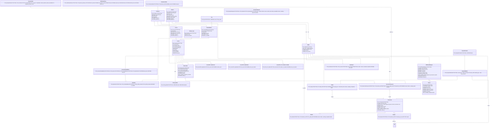

```mermaid
---
config:
  layout: elk
---
classDiagram

    %% Pessoas / entidades
    class Professor{
        PK id_Professor INT NOT NULL
        VARCHAR name NOT NULL
        VARCHAR email
        TEXT biography
        DATETIME created_at
        DATETIME updated_at
    }

    class Student{
        PK id_Student INT NOT NULL
        VARCHAR name NOT NULL
        VARCHAR email
        TEXT password_hash
        VARCHAR cell_phone_number
        BOOLEAN email_verified
        DATETIME created_at
        DATETIME updated_at
    }

    %% Conteúdo de aulas
    class Course{
        PK id_Course INT NOT NULL
        FK id_Professor
        VARCHAR name NOT NULL
        VARCHAR level_of_education
        DATETIME created_at
        DATETIME updated_at
    }

    class Tutoring_Type{
        PK id_Tutoring_Type INT NOT NULL
        VARCHAR name
        VARCHAR description
    }

    %% Agendamento
    class Day{ PK id_Day INT NOT NULL; VARCHAR name; INT day_index }

    class ScheduleBlock{
        PK id_ScheduleBlock INT NOT NULL
        FK id_Professor INT NOT NULL
        FK id_Day INT
        DATETIME start_time
        DATETIME end_time
        BOOLEAN is_available
    }

    class BlockPart{ PK id_BlockPart INT NOT NULL; FK id_ScheduleBlock INT NOT NULL; INT start_offset_minutes; INT end_offset_minutes; BOOLEAN is_available }

    class Lesson{
        PK id_Lesson INT NOT NULL
        FK id_Course INT
        FK id_Professor INT
        FK id_Tutoring_Type INT
        FK id_Pricing_Model INT
        VARCHAR title
        INT capacity
        INT min_students
        INT max_students
        DECIMAL base_price
    }

    class LessonScheduleBlock{ PK id_LessonScheduleBlock INT NOT NULL; FK id_Lesson INT NOT NULL; FK id_ScheduleBlock INT NOT NULL; FK id_BlockPart INT; DATETIME start_time; DATETIME end_time }

    class Reservation{
        PK id_Reservation INT NOT NULL
        FK id_Student INT NOT NULL
        FK id_Lesson INT NOT NULL
        FK id_LessonScheduleBlock INT
        DATETIME start_time
        DATETIME end_time
        status : pending | confirmed | cancelled
        DATETIME created_at
    }

    class ExceptionRequest{ PK id_ExceptionRequest INT NOT NULL; FK id_Student INT; FK id_Reservation INT; request_type : extend | shorten | move | custom_time | block_unavailable; status : pending | approved | denied }
    class ExceptionRule{ PK id_ExceptionRule INT NOT NULL; FK id_Professor INT; FK id_ScheduleBlock INT; rule_type : unavailable | custom_duration | partial_unavailable; FK originating_request_id INT }

    %% Pricing / modelos
    class Pricing_Model{ PK id_Pricing_Model INT NOT NULL; VARCHAR name; VARCHAR description }
    class LessonPrice_BySession{ PK id_LessonPrice_BySession INT; FK id_Lesson INT; DECIMAL session_price }
    class LessonPrice_ByStudent{ PK id_LessonPrice_ByStudent INT; FK id_Lesson INT; DECIMAL price_per_student }
    class LessonPrice_Per_Student_Variable{ PK id_Price_Per_Student INT; FK id_Lesson INT; INT number_of_students; DECIMAL price_per_student }

    class Enrollment{ PK id_Enrollment INT NOT NULL; FK id_Lesson INT NOT NULL; FK id_Student INT NOT NULL; status : active | cancelled | completed; DECIMAL price_paid }

    %% Pagamentos / carteiras
    class Wallet{
        PK id_Wallet INT NOT NULL
        owner_type : student | professor
        FK owner_id INT NOT NULL
        DECIMAL balance
        DECIMAL hold_amount
    }

    class Transaction{
        PK id_Transaction INT NOT NULL
        FK wallet_id INT NOT NULL
        transaction_type : topup | payment | payout | refund | commission | fee
        DECIMAL amount
        DECIMAL balance_before
        DECIMAL balance_after
        status : pending | completed | failed
        DATETIME created_at
    }

    class TopUp{ PK id_TopUp INT NOT NULL; FK wallet_id INT NOT NULL; DECIMAL amount; topup_type : card | bank | promo; status : pending | completed | failed }
    class WithdrawalRequest{
        PK id_WithdrawalRequest INT NOT NULL
        FK wallet_id INT NOT NULL
        DECIMAL requested_amount
        DECIMAL fee_amount
        DECIMAL net_amount
        FK payment_method_id INT
        FK payment_provider_id INT
        status : pending | requires_approval | processed | rejected
        DATETIME requested_at
        DATETIME processed_at
    }
    class PaymentMethod{ PK id_PaymentMethod INT NOT NULL; owner_type : student | professor; FK owner_id INT; method_type : card | bank_account }
    class PaymentProvider{ PK id_PaymentProvider INT NOT NULL; VARCHAR name }
    class ReservationPayment{ PK id_ReservationPayment INT NOT NULL; FK reservation_id INT NOT NULL; FK payer_wallet_id INT; FK transaction_id INT; DECIMAL amount; status : pending | paid | refunded }
    class Payout{
        PK id_Payout INT NOT NULL
        FK withdrawal_request_id INT
        FK transaction_id INT
        DECIMAL gross_amount
        DECIMAL provider_fee_amount
        DECIMAL platform_fee_amount
        DECIMAL net_amount
        status : pending | completed | failed
    }

    class WithdrawalPolicy{ PK id_WithdrawalPolicy INT NOT NULL; FK payment_provider_id INT; DECIMAL min_amount; DECIMAL min_balance_after; DECIMAL fixed_fee; DECIMAL percent_fee; BOOLEAN active; DATETIME effective_from; DATETIME effective_to }
    class Refund{ PK id_Refund INT NOT NULL; FK transaction_id INT; FK to_wallet_id INT; DECIMAL amount; status : pending | completed | failed }
    class CommissionRule{ PK id_CommissionRule INT NOT NULL; FK professor_id INT; DECIMAL percent; DECIMAL fixed_fee }
    class Dispute{ PK id_Dispute INT NOT NULL; FK transaction_id INT; FK raised_by_user_id INT; TEXT reason }

    %% Relações entre blocos e pagamentos
    Professor "1" -- "*" Course
    Professor "1" -- "*" ScheduleBlock
    Day "1" -- "*" ScheduleBlock
    ScheduleBlock "1" -- "*" BlockPart
    Course "1" -- "*" Lesson
    Tutoring_Type "1" -- "*" Lesson
    Lesson "1" -- "*" LessonScheduleBlock
    LessonScheduleBlock "1" -- "0..1" BlockPart
    Lesson "1" -- "*" Enrollment
    Student "1" -- "*" Enrollment
    Lesson "1" -- "*" Reservation
    Student "1" -- "*" Reservation
    Reservation "1" -- "1" ReservationPayment

    %% Relações de pricing específico por lesson
    Lesson "1" -- "0..1" LessonPrice_BySession
    Lesson "1" -- "0..1" LessonPrice_ByStudent
    Lesson "1" -- "0..1" LessonPrice_Per_Student_Variable
    Lesson "*" -- "1" Pricing_Model : uses

    Wallet "1" -- "*" Transaction
    Wallet "1" -- "*" TopUp
    Wallet "1" -- "*" WithdrawalRequest
    PaymentMethod "1" -- "*" TopUp
    PaymentProvider "1" -- "*" PaymentMethod
    Transaction "1" -- "0..1" Refund
    Transaction "1" -- "0..1" Dispute
    ReservationPayment "1" -- "1" Transaction : records
    Wallet "1" -- "*" ReservationPayment : pays
    WithdrawalRequest "1" -- "0..1" Payout

    %% Add small missing payment↔domain links
    Refund "1" -- "1" Wallet : to_wallet
    Dispute "1" -- "1" User : raised_by
    TopUp "1" -- "0..1" Transaction : creates
    PaymentMethod "1" -- "1" User : owner

    %% Ligações financeiras entre alunos/professores
    Student "1" -- "1" Wallet : has
    Professor "1" -- "1" Wallet : has
    CommissionRule "*" -- "1" Professor
    CommissionRule "0..1" -- "*" ReservationPayment : applies_to

    %% Ligações de exceção
    ExceptionRule "1" -- "*" ExceptionRequest

    %% Notas
    %% - Reservas pagas geram ReservationPayment + Transaction; reembolsos atualizam Wallet/Transaction.
    %% - Holds devem usar Wallet.hold_amount até confirmação.
    %% - Comissões aplicadas no momento do pagamento; platform records as Transaction type = commission.
```
