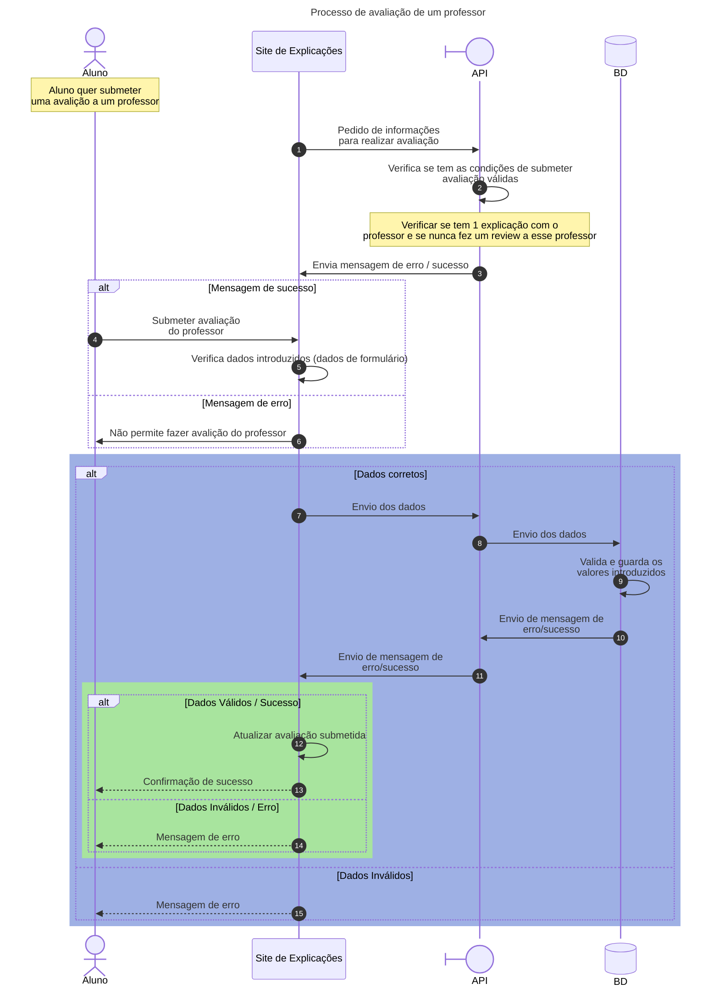

```mermaid
sequenceDiagram
    title Processo de avaliação de um professor
    actor Aluno
    participant Site as Site de Explicações
    participant API@{ "type": "boundary"}
    participant BD@{ "type": "database" }
    autonumber
    Note over Aluno: Aluno quer submeter <br/> uma avalição a um professor
    Site->>API: Pedido de informações <br/> para realizar avaliação
    API->>API: Verifica se tem as condições de submeter <br/> avaliação válidas 
    Note over API: Verificar se tem 1 explicação com o <br/> professor e se nunca fez um review a esse professor
    API->>Site: Envia mensagem de erro / sucesso
    alt Mensagem de sucesso
        Aluno->>Site: Submeter avaliação <br/>  do professor
        Site->>Site:Verifica dados introduzidos (dados de formulário)
    else Mensagem de erro
        Site->>Aluno: Não permite fazer avalição do professor
    end
    rect rgba(158, 176, 228, 1)
    alt Dados corretos
        Site->>API: Envio dos dados
        API->>BD: Envio dos dados
        BD->>BD: Valida e guarda os <br/> valores introduzidos
        BD->>API: Envio de mensagem de <br/> erro/sucesso
        API->>Site: Envio de mensagem de <br/> erro/sucesso
        rect rgba(168, 228, 158, 1)
        alt Dados Válidos / Sucesso
            Site->>Site: Atualizar avaliação submetida
            Site-->>Aluno: Confirmação de sucesso
        else Dados Inválidos / Erro
            Site-->>Aluno: Mensagem de erro
        end
        end
    else Dados Inválidos
        Site-->>Aluno: Mensagem de erro
    end
    end
    
```