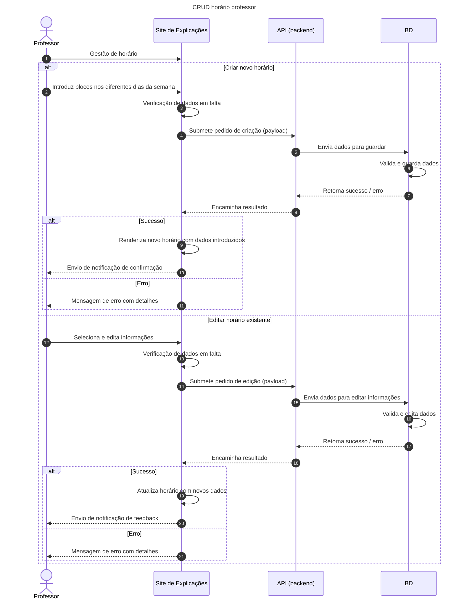

```mermaid
---
config:
  sequence:
    actorFontSize: 18
    noteFontSize: 40
    messageFontSize: 26
---
sequenceDiagram
    autonumber
    actor Professor
    participant Site as Site de Explicações
    participant API as API (backend)
    participant BD as BD
    title CRUD horário professor
    Professor->>Site: Gestão de horário

    alt Criar novo horário
        Professor->>Site: Introduz blocos nos diferentes dias da semana
        Site->>Site: Verificação de dados em falta
        Site->>API: Submete pedido de criação (payload)
        API->>BD: Envia dados para guardar
        BD->>BD: Valida e guarda dados
        BD-->>API: Retorna sucesso / erro
        API-->>Site: Encaminha resultado
        alt Sucesso
            Site->>Site: Renderiza novo horário com dados introduzidos
            Site-->>Professor: Envio de notificação de confirmação
        else Erro
            Site-->>Professor: Mensagem de erro com detalhes
        end

    else Editar horário existente
        Professor->>Site: Seleciona e edita informações
        Site->>Site: Verificação de dados em falta
        Site->>API: Submete pedido de edição (payload)
        API->>BD: Envia dados para editar informações
        BD->>BD: Valida e edita dados
        BD-->>API: Retorna sucesso / erro
        API-->>Site: Encaminha resultado
        alt Sucesso
            Site->>Site: Atualiza horário com novos dados
            Site-->>Professor: Envio de notificação de feedback
        else Erro
            Site-->>Professor: Mensagem de erro com detalhes
        end
    end

```
