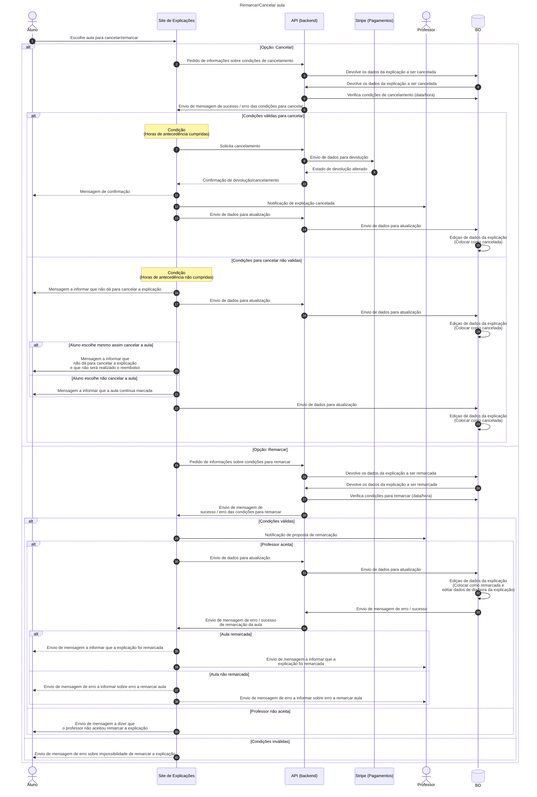

```mermaid
---
config:
  sequence:
    actorFontSize: 18
    noteFontSize: 40 
    messageFontSize: 26
---
sequenceDiagram
    autonumber
    actor Aluno
    participant Site as Site de Explicações
    participant API as API (backend)
    participant Stripe as Stripe (Pagamentos)
    actor Professor
    participant BD@{ "type": "database" }
    
    
    title Remarcar/Cancelar aula
    Aluno->>Site: Escolhe aula para cancelar/remarcar
    
    
    alt Opção: Cancelar
        Site->>API: Pedido de informações sobre condições de cancelamento
        API->>BD: Devolve os dados da explicação a ser cancelada
        BD->>API: Devolve os dados da explicação a ser cancelada
        API->>BD: Verifica condições de cancelamento (data/hora)
        API->>Site: Envio de mensagem de sucesso / erro das condições para cancelar
        alt Condições válidas para cancelar
            Note over Site: Condição <br/> (Horas de antecedência cumpridas)
            Site->>API: Solicita cancelamento
            API->>Stripe: Envio de dados para devolução
            Stripe-->>API: Estado de devolução alterado
            API-->>Site: Confirmação de devolução/cancelamento
            Site-->>Aluno: Mensagem de confirmação
            Site->>Professor: Notificação de explicação cancelada
            Site->>API: Envio de dados para atualização
            API->>BD: Envio de dados para atualização
            BD->>BD: Ediçao de dados da explicação <br/> (Colocar como cancelada)
        else Condições para cancelar não validas
            Note over Site: Condição <br/> (Horas de antecedência não cumpridas)
            Site->>Aluno: Mensagem a informar que não dá para cancelar a explicação
            Site->>API: Envio de dados para atualização
            API->>BD: Envio de dados para atualização
            BD->>BD: Ediçao de dados da explicação <br/> (Colocar como cancelada)
            alt Aluno escolhe mesmo assim cancelar a aula
                Site->>Aluno: Mensagem a informar que <br/> não dá para cancelar a explicação <br/> e que não será realizado o reembolso
            else Aluno escolhe não cancelar a aula
                Site->>Aluno: Mensagem a informar que a aula continua marcada
            end
            Site->>BD: Envio de dados para atualização
            BD->>BD: Ediçao de dados da explicação <br/> (Colocar como cancelada)
        end
    else Opção: Remarcar
        Site->>API: Pedido de informações sobre condições para remarcar
        API->>BD: Devolve os dados da explicação a ser remarcada
        BD->>API: Devolve os dados da explicação a ser remarcada
        API->>BD: Verifica condições para remarcar (data/hora)
        API->>Site: Envio de mensagem de <br/> sucesso / erro das condições para remarcar
        alt Condições válidas
            Site->>Professor: Notificação de proposta de remarcação
            alt Professor aceita
                Site->>API: Envio de dados para atualização
                API->>BD: Envio de dados para atualização
                BD->>BD: Ediçao de dados da explicação <br/> (Colocar como remarcada e <br/> editar dados de dia/hora da explicação)
                BD->>API: Envio de mensagem de erro / sucesso
                API->>Site: Envio de mensagem de erro / sucesso <br/> de remarcação da aula
                alt Aula remarcada
                    Site-->>Aluno: Envio de mensagem a informar que a explicação foi remarcada
                    Site-->>Professor: Envio de mensagem a informar que a <br/> explicação foi remarcada
                else Aula não remarcada
                    Site-->>Aluno: Envio de mensagem de erro a informar sobre erro a remarcar aula
                    Site-->>Professor: Envio de mensagem de erro a informar sobre erro a remarcar aula
                end
            else Professor não aceita
                Site->>Aluno: Envio de mensagem a dizer que <br/> o professor não aceitou remarcar a explicação
            end
        else Condições inválidas
            Site-->>Aluno: Envio de mensagem de erro sobre impossibilidade de remarcar a explicação
        end
    end
```