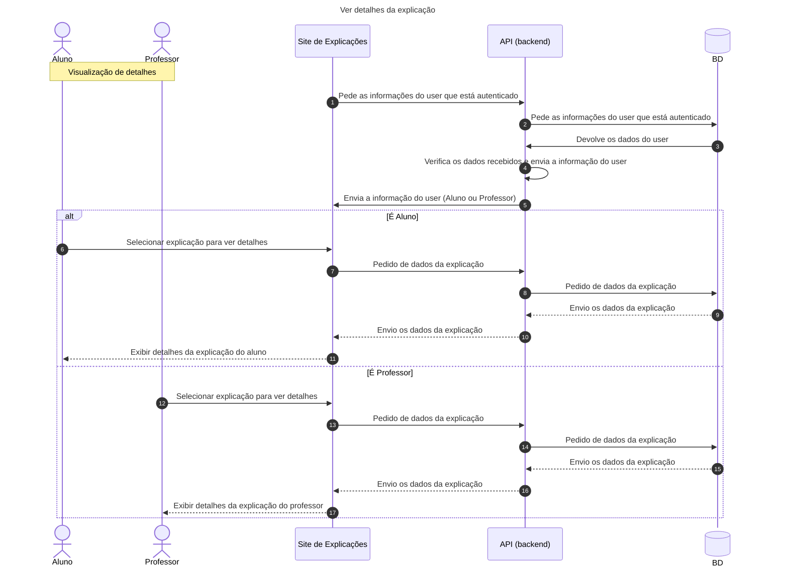

```mermaid
---
config:
  sequence:
    actorFontSize: 30
    noteFontSize: 40
    messageFontSize: 26
---
sequenceDiagram
    autonumber
    actor Aluno
    actor Professor
    participant Site as Site de Explicações
    participant API as API (backend)
    participant BD@{ "type": "database" }
    title Ver detalhes da explicação

    Note over Aluno, Professor: Visualização de detalhes
    Site->>API: Pede as informações do user que está autenticado
    API->>BD: Pede as informações do user que está autenticado
    BD->>API: Devolve os dados do user
    API->>API: Verifica os dados recebidos e envia a informação do user
    API->>Site: Envia a informação do user (Aluno ou Professor)
    alt É Aluno
        Aluno->>Site: Selecionar explicação para ver detalhes
        Site->>API: Pedido de dados da explicação
        API->>BD: Pedido de dados da explicação
        BD-->>API: Envio os dados da explicação
        API-->>Site: Envio os dados da explicação
        Site-->>Aluno: Exibir detalhes da explicação do aluno
    else É Professor
        Professor->>Site: Selecionar explicação para ver detalhes
        Site->>API: Pedido de dados da explicação
        API->>BD: Pedido de dados da explicação
        BD-->>API: Envio os dados da explicação
        API-->>Site: Envio os dados da explicação
        Site-->>Professor: Exibir detalhes da explicação do professor
    end
```