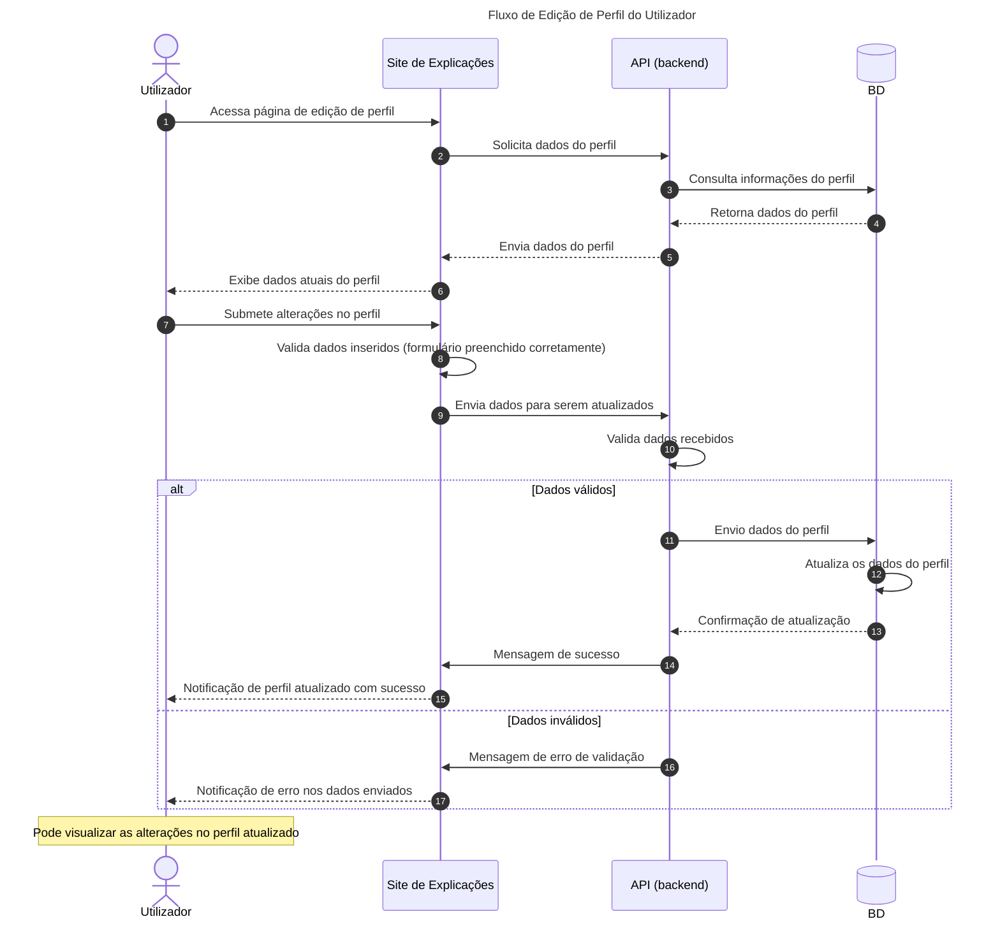

```mermaid

sequenceDiagram
    autonumber
    actor Utilizador
    participant Site as Site de Explicações
    participant API as API (backend)
    participant BD@{ "type": "database" }

    title Fluxo de Edição de Perfil do Utilizador

    Utilizador->>Site: Acessa página de edição de perfil
    Site->>API: Solicita dados do perfil
    API->>BD: Consulta informações do perfil
    BD-->>API: Retorna dados do perfil
    API-->>Site: Envia dados do perfil
    Site-->>Utilizador: Exibe dados atuais do perfil
    Utilizador->>Site: Submete alterações no perfil
    Site->>Site: Valida dados inseridos (formulário preenchido corretamente)
    Site->>API: Envia dados para serem atualizados
    API->>API: Valida dados recebidos
    alt Dados válidos
        API->>BD: Envio dados do perfil
        BD->>BD: Atualiza os dados do perfil
        BD-->>API: Confirmação de atualização
        API->>Site: Mensagem de sucesso
        Site-->>Utilizador: Notificação de perfil atualizado com sucesso
    else Dados inválidos
        API->>Site: Mensagem de erro de validação
        Site-->>Utilizador: Notificação de erro nos dados enviados
    end

    Note over Utilizador: Pode visualizar as alterações no perfil atualizado

```