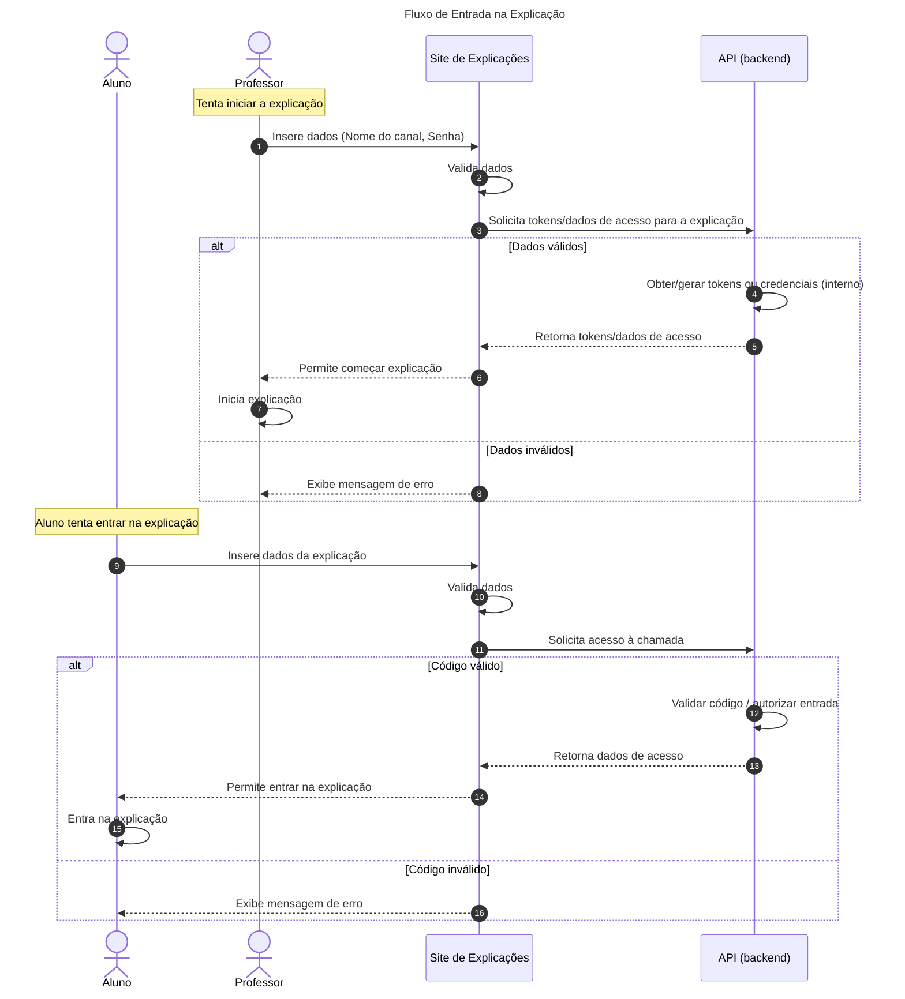

```mermaid

sequenceDiagram
    autonumber
    actor Aluno
    actor Professor
    participant Site as Site de Explicações
    participant API as API (backend)
    %%participant BD@{ "type": "database" }
    title Fluxo de Entrada na Explicação

    Note over Professor: Tenta iniciar a explicação

    Professor->>Site: Insere dados (Nome do canal, Senha)
    Site->>Site: Valida dados
    Site->>API: Solicita tokens/dados de acesso para a explicação
    alt Dados válidos
        API->>API: Obter/gerar tokens ou credenciais (interno)
        API-->>Site: Retorna tokens/dados de acesso
        Site-->>Professor: Permite começar explicação
        Professor->>Professor: Inicia explicação
    else Dados inválidos
        Site-->>Professor: Exibe mensagem de erro
    end

    Note over Aluno: Aluno tenta entrar na explicação
    Aluno->>Site: Insere dados da explicação
    Site->>Site: Valida dados
    Site->>API: Solicita acesso à chamada
    alt Código válido
        API->>API: Validar código / autorizar entrada
        API-->>Site: Retorna dados de acesso
        Site-->>Aluno: Permite entrar na explicação
        Aluno->>Aluno: Entra na explicação
    else Código inválido
        Site-->>Aluno: Exibe mensagem de erro
    end
```