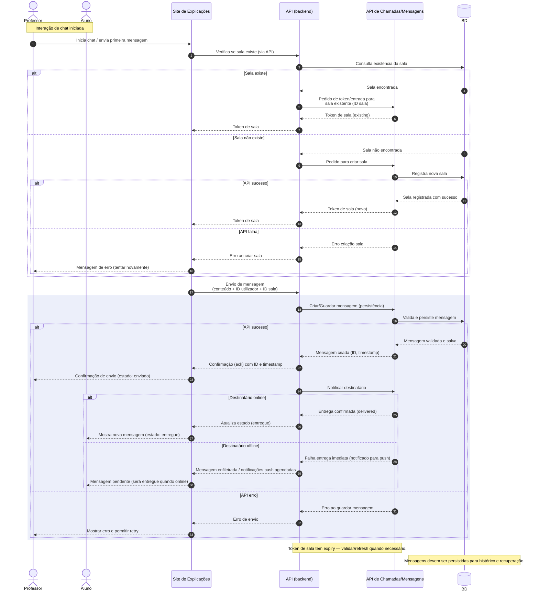

```mermaid

sequenceDiagram
    autonumber
    actor Professor
    actor Aluno
    participant Site as Site de Explicações
    participant APIBack as API (backend)
    participant API as API de Chamadas/Mensagens
    participant BD@{ "type": "database" }

    Note over Professor, Aluno: Interação de chat iniciada
    
    %% Sala: criar ou juntar
    Professor->>Site: Inicia chat / envia primeira mensagem
    Site->>APIBack: Verifica se sala existe (via API)
    APIBack->>BD: Consulta existência da sala
    alt Sala existe
        BD-->>APIBack: Sala encontrada
        APIBack->>API: Pedido de token/entrada para <br/> sala existente (ID sala)
        API-->>APIBack: Token de sala (existing)
        APIBack-->>Site: Token de sala
    else Sala não existe
        BD-->>APIBack: Sala não encontrada
        APIBack->>API: Pedido para criar sala
        API->>BD: Registra nova sala
        alt API sucesso
            BD-->>API: Sala registrada com sucesso
            API-->>APIBack: Token de sala (novo)
            APIBack-->>Site: Token de sala
        else API falha
            API-->>APIBack: Erro criação sala
            APIBack-->>Site: Erro ao criar sala
            Site-->>Professor: Mensagem de erro (tentar novamente)
        end
    end

    %% Envio de mensagem
    Site->>APIBack: Envio de mensagem <br/>(conteúdo + ID utilizador + ID sala)
    rect rgba(158,176,228,0.2)
    APIBack->>API: Criar/Guardar mensagem (persistência)
    API->>BD: Valida e persiste mensagem
    alt API sucesso
        BD-->>API: Mensagem validada e salva
        API-->>APIBack: Mensagem criada (ID, timestamp)
        APIBack-->>Site: Confirmação (ack) com ID e timestamp
        Site-->>Professor: Confirmação de envio (estado: enviado)
        APIBack->>API: Notificar destinatário
        alt Destinatário online
            API-->>APIBack: Entrega confirmada (delivered)
            APIBack-->>Site: Atualiza estado (entregue)
            Site-->>Aluno: Mostra nova mensagem (estado: entregue)
        else Destinatário offline
            API-->>APIBack: Falha entrega imediata (notificado para push)
            APIBack-->>Site: Mensagem enfileirada / notificações push agendadas
            Site-->>Aluno: Mensagem pendente (será entregue quando online)
        end
    else API erro
        API-->>APIBack: Erro ao guardar mensagem
        APIBack-->>Site: Erro de envio
        Site-->>Professor: Mostrar erro e permitir retry
    end
    end

    Note over API, APIBack: Token de sala tem expiry — validar/refresh quando necessário.
    Note over BD: Mensagens devem ser persistidas para histórico e recuperação.
```