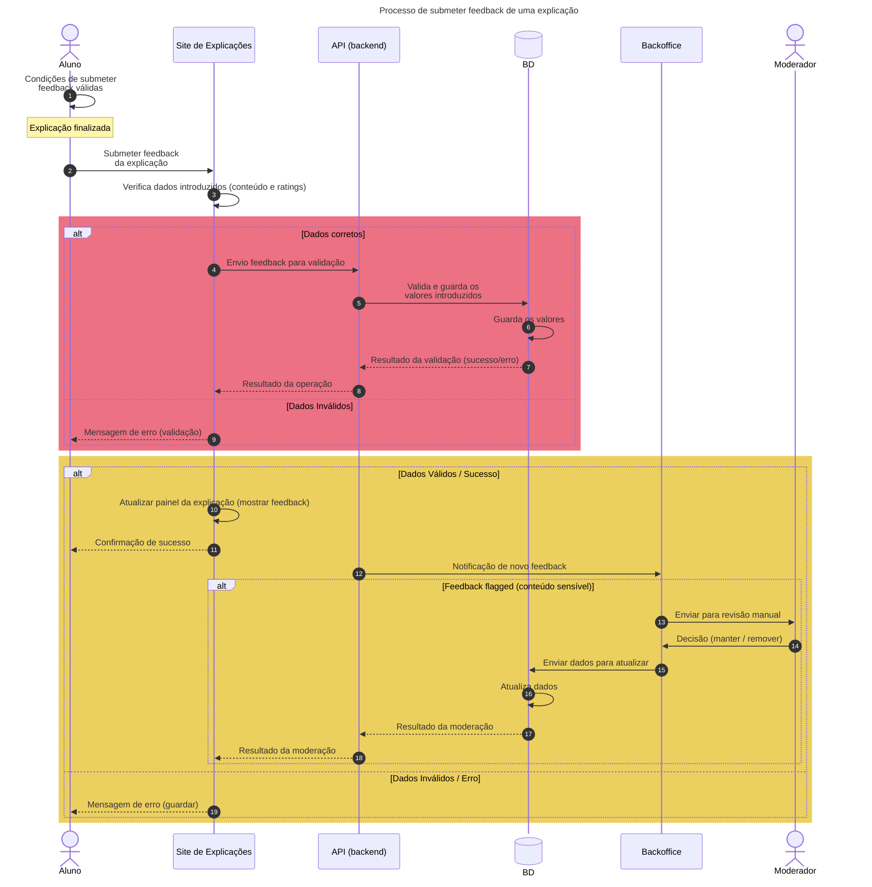

```mermaid
---
config:
  sequence:
    actorFontSize: 18
    noteFontSize: 40
    messageFontSize: 26
---
sequenceDiagram
    title Processo de submeter feedback de uma explicação
    actor Aluno
    participant Site as Site de Explicações
    participant API as API (backend)
    participant BD@{ "type": "database" }
    participant BO as Backoffice
    actor Admin as Moderador
    autonumber
    Aluno->>Aluno: Condições de submeter <br/> feedback válidas
    Note over Aluno: Explicação finalizada
    Aluno->>Site: Submeter feedback <br/> da explicação
    Site->>Site: Verifica dados introduzidos (conteúdo e ratings)

    rect rgba(236, 113, 131, 1)
    alt Dados corretos
        Site->>API: Envio feedback para validação
        API->>BD: Valida e guarda os <br/> valores introduzidos
        BD->>BD:Guarda os valores
        BD-->>API: Resultado da validação (sucesso/erro)
        API-->>Site: Resultado da operação
    else Dados Inválidos
        Site-->>Aluno: Mensagem de erro (validação)
    end
    end
    rect rgba(236, 208, 95, 1)
    alt Dados Válidos / Sucesso
        Site->>Site: Atualizar painel da explicação (mostrar feedback)
        Site-->>Aluno: Confirmação de sucesso
        API->>BO: Notificação de novo feedback
        alt Feedback flagged (conteúdo sensível)
            BO->>Admin: Enviar para revisão manual
            Admin->>BO: Decisão (manter / remover)
            BO->>BD:Enviar dados para atualizar
            BD->>BD:Atualiza dados
            BD-->>API: Resultado da moderação
            API-->>Site: Resultado da moderação
        end
    else Dados Inválidos / Erro
        Site-->>Aluno: Mensagem de erro (guardar)
    end
    end
```