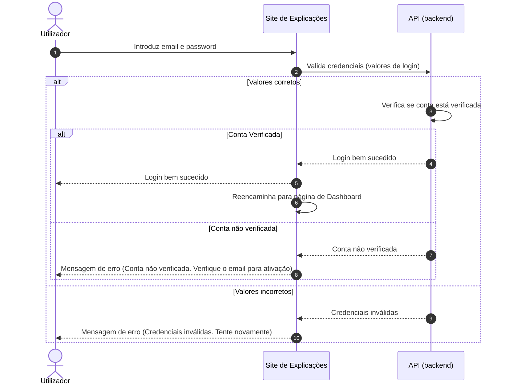

```mermaid
sequenceDiagram
    autonumber
    actor Utilizador
    participant Site as Site de Explicações
    participant API as API (backend)

    Utilizador->>Site: Introduz email e password
    Site->>API: Valida credenciais (valores de login)

    alt Valores corretos
        API->>API: Verifica se conta está verificada
        alt Conta Verificada
            API-->>Site: Login bem sucedido
            Site-->>Utilizador: Login bem sucedido
            Site->>Site: Reencaminha para página de Dashboard
        else Conta não verificada
            API-->>Site: Conta não verificada
            Site-->>Utilizador: Mensagem de erro (Conta não verificada. Verifique o email para ativação)
        end
    else Valores incorretos
        API-->>Site: Credenciais inválidas
        Site-->>Utilizador: Mensagem de erro (Credenciais inválidas. Tente novamente)
    end
```