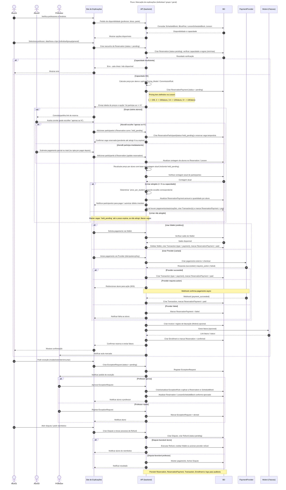

```mermaid
sequenceDiagram
    autonumber
    actor AlunoA as Aluno1
    actor AlunoB as Aluno2
    actor Professor
    participant Site as Site de Explicações
    participant API as API (backend)
    participant BD as BD
    participant PaymentProvider as PaymentProvider
    participant Moloni as Moloni (Faturas)

    title Fluxo: Marcação de explicações (individual / grupo / geral)

    %% Passo 1: Escolha e verificação de disponibilidade
    AlunoA->>Site: Verifica professores e horários
    Site->>API: Pedido de disponibilidade (professor, bloco, parte)
    API->>BD: Consultar ScheduleBlock, BlockPart, LessonScheduleBlock, Lesson
    BD-->>API: Disponibilidade e capacidade
    API-->>Site: Mostrar opções disponíveis

    %% Escolha do aluno e início do fluxo de reserva
    AlunoA->>Site: Seleciona professor, data/hora e tipo (individual/group/general)
    Site->>API: Criar rascunho de Reservation (status = pending)
    API->>BD: Criar Reservation (status pending), verificar capacidade e regras (min/max)
    BD-->>API: Resultado verificação

    alt Capacidade insuficiente
        API-->>Site: Erro - sala cheia / não disponível
        Site-->>AlunoA: Mostrar erro
    else Capacidade OK
        API->>API: Calcular preço por aluno e aplicar Pricing_Model / CommissionRule
        API->>BD: Criar ReservationPayment (status = pending)

        %% Pricing tiers: valores pré-definidos por número de participantes
        Note right of API: Pricing tiers definidos na Lesson
        Note right of API: 1 -> 20€, 2 -> 15€/aluno, 3-4 -> 12€/aluno, 5+ -> 10€/aluno
        API->>Site: Enviar tabela de preços e opção "só participo se >= N"

        opt Grupo (vários alunos)
            Site-->>AlunoB: Convida/partilha link de reserva
            AlunoB->>Site: Aceita convite (pode escolher "apenas se N")
            alt AlunoB escolhe "apenas se N"
                Site->>API: Adicionar participante à Reservation como `held_pending`
                API->>BD: Criar ReservationParticipant(status=held_pending) e reservar vaga temporária
                API-->>Site: Confirmar vaga reservada (pendente até atingir N ou expirar)
            else AlunoB participa imediatamente
                AlunoB->>Site: Submete pagamento parcial ou total (ou opta por pagar depois)
                Site->>API: Adicionar participante à Reservation (update reservation)
                API->>BD: Atualizar contagem de alunos no Reservation / Lesson
            end
            API->>API: Recalcular preço por aluno com base na contagem atual (incluindo held_pending)

            %% Finalizar quando o limiar é atingido
            API->>BD: Verificar contagem atual de participantes
            BD-->>API: Contagem atual
            alt Limiar atingido (>= N ou capacidade)
                API->>API: Determinar `price_per_student` segundo escalão correspondente
                API->>BD: Atualizar ReservationPayment.amount e quantidade por aluno
                API-->>Site: Notificar participantes para pagar / autorizar débito imediato
                API->>BD: Se já houver pagamentos/autorizações, criar Transaction(s) e marcar ReservationPayment = paid
            else Limiar não atingido
                Note over API,Site: Manter vagas `held_pending` até o prazo expirar, se não atingir, liberar vagas
            end
        end

        %% Pagamento: escolha entre Wallet ou Provider
        alt Usar Wallet (créditos)
            Site->>API: Solicita pagamento via Wallet
            API->>BD: Verificar saldo do Wallet
            BD-->>API: Saldo disponível
            API->>BD: Debitar Wallet, criar Transaction (type = payment), marcar ReservationPayment = paid
        else Usar Provider (cartao)
            Site->>API: Iniciar pagamento via Provider (idempotencyKey)
            API->>PaymentProvider: Criar pagamento externo / checkout
            PaymentProvider-->>API: Resposta (succeeded | requires_action | failed)
            alt Provider succeeded
                API->>BD: Criar Transaction (type = payment), marcar ReservationPayment = paid
            else Provider requires action
                API-->>Site: Redirecionar aluno para ação (3DS)
                Note over PaymentProvider,API: Webhook confirma pagamento async
                PaymentProvider-->>API: Webhook (payment_succeeded)
                API->>BD: Criar Transaction, marcar ReservationPayment = paid
            else Provider failed
                API->>BD: Marcar ReservationPayment = failed
                API-->>Site: Notificar falha ao aluno
            end
        end

        %% Confirmação final e criação de Enrollment
        API->>BD: Criar Invoice / registo de faturação (Moloni) opcional
        API->>Moloni: Gerar fatura (opcional)
        Moloni-->>API: Link fatura / status
        API->>BD: Criar Enrollment e marcar Reservation = confirmed
        API-->>Site: Confirmar reserva e enviar fatura
        Site-->>AlunoA: Mostrar confirmação
        API->>Professor: Notificar aula marcada
    end

    %% Exceções e pedidos do aluno (ex.: mudar hora, estender duração)
    AlunoA->>Site: Pedir exceção (mudar/estender/encurtar)
    Site->>API: Criar ExceptionRequest (status = pending)
    API->>BD: Registar ExceptionRequest
    API->>Professor: Notificar pedido de exceção
    alt Professor aprova
        Professor->>API: Aprovar ExceptionRequest
        API->>BD: Criar/actualizar ExceptionRule e aplicar a Reservation or ScheduleBlock
        API->>BD: Atualizar Reservation / LessonScheduleBlock conforme aprovado
        API-->>Site: Notificar aluno e professor
    else Professor rejeita
        Professor->>API: Rejeitar ExceptionRequest
        API->>BD: Marcar ExceptionRequest = denied
        API-->>Site: Notificar aluno
    end

    %% Disputas e reembolsos (se pagamento via credits ou provider)
    AlunoA->>Site: Abrir disputa / pedir reembolso
    Site->>API: Criar Dispute e iniciar processo de Refund
    API->>BD: Criar Dispute, criar Refund (status pending)
    alt Disputa favorável aluno
        API->>BD: Executar Refund, creditar Wallet ou acionar provider refund
        API-->>Site: Notificar aluno do reembolso
    else Disputa favorável professor
        API->>BD: Manter pagamento, fechar Dispute
        API-->>Site: Notificar resultado
    end

    Note over API,BD: Persistir Reservation, ReservationPayment, Transaction, Enrollment e logs para auditoria
```