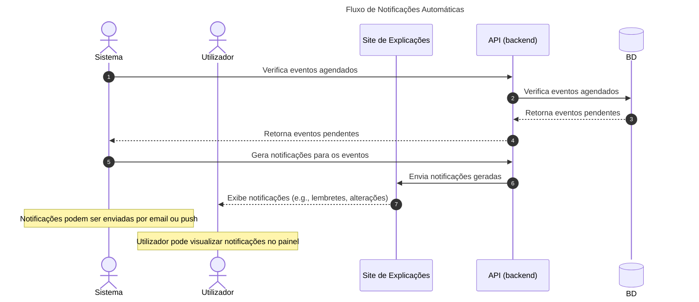

```mermaid

sequenceDiagram
    actor Sistema
    actor Utilizador
    participant Site as Site de Explicações
    participant APIBack as API (backend)
    participant BD@{ "type": "database" }
    autonumber

    title Fluxo de Notificações Automáticas

    Sistema->>APIBack: Verifica eventos agendados
    APIBack->>BD: Verifica eventos agendados
    BD-->>APIBack: Retorna eventos pendentes
    APIBack-->>Sistema: Retorna eventos pendentes
    Sistema->>APIBack: Gera notificações para os eventos
    APIBack->>Site: Envia notificações geradas
    Site-->>Utilizador: Exibe notificações (e.g., lembretes, alterações)

    Note over Sistema: Notificações podem ser enviadas por email ou push
    Note over Utilizador: Utilizador pode visualizar notificações no painel
```