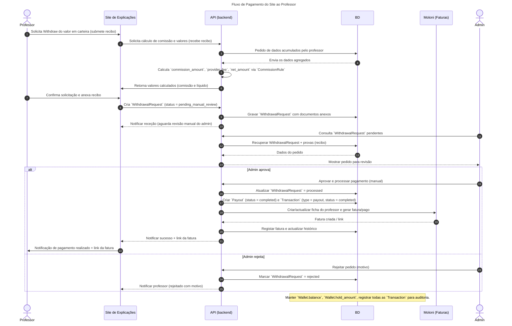

```mermaid

sequenceDiagram
    autonumber
    actor Professor
    participant Site as Site de Explicações
    participant API as API (backend)
    participant BD as BD
    participant Moloni as Moloni (Faturas)

    title Fluxo de Pagamento do Site ao Professor

    Professor->>Site: Solicita Withdraw do valor em carteira (submete recibo)
    Site->>API: Solicita cálculo de comissão e valores (recebe recibo)
    API->>BD: Pedido de dados acumulados pelo professor
    BD-->>API: Envia os dados agregados
    API->>API: Calcula `commission_amount`, `provider_fee`, `net_amount` via `CommissionRule`
    API->>Site: Retorna valores calculados (comissão e líquido)
    Professor->>Site: Confirma solicitação e anexa recibo
    Site->>API: Cria `WithdrawalRequest` (status = pending_manual_review)
    API->>BD: Gravar `WithdrawalRequest` com documentos anexos
    API-->>Site: Notificar receção (aguarda revisão manual do admin)

    %% Fluxo manual do admin
    actor Admin
    Admin->>API: Consulta `WithdrawalRequest` pendentes
    API->>BD: Recuperar WithdrawalRequest + provas (recibo)
    BD-->>API: Dados do pedido
    API-->>Admin: Mostrar pedido para revisão
    alt Admin aprova
        Admin->>API: Aprovar e processar pagamento (manual)
        API->>BD: Atualizar `WithdrawalRequest` = processed
        API->>BD: Criar `Payout` (status = completed) e `Transaction` (type = payout, status = completed)
        API->>Moloni: Criar/actualizar ficha do professor e gerar fatura/pago
        Moloni-->>API: Fatura criada / link
        API->>BD: Registar fatura e actualizar histórico
        API-->>Site: Notificar sucesso + link da fatura
        Site->>Professor: Notificação de pagamento realizado + link da fatura
    else Admin rejeita
        Admin->>API: Rejeitar pedido (motivo)
        API->>BD: Marcar `WithdrawalRequest` = rejected
        API-->>Site: Notificar professor (rejeitado com motivo)
    end

    Note over BD: Manter `Wallet.balance`, `Wallet.hold_amount`, registrar todas as `Transaction` para auditoria.

```