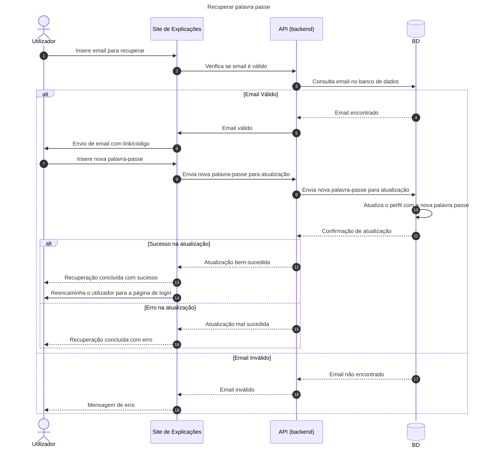

```mermaid
sequenceDiagram
    autonumber
    actor Utilizador
    participant Site as Site de Explicações
    participant API as API (backend)
    participant BD@{ "type": "database" }
    title Recuperar palavra passe

    Utilizador->>Site: Insere email para recuperar
    Site->>API: Verifica se email é válido
    API->>BD: Consulta email no banco de dados
    alt Email Válido
        BD-->>API: Email encontrado
        API->>Site: Email válido
        Site->>Utilizador: Envio de email com link/código
        Utilizador->>Site: Insere nova palavra-passe
        Site->>API: Envia nova palavra-passe para atualização
        API->>BD: Envia nova palavra-passe para atualização
        BD->>BD: Atualiza o perfil com a nova palavra passe
        BD-->>API: Confirmação de atualização
        alt Sucesso na atualização
            API-->>Site: Atualização bem-sucedida
            Site-->>Utilizador: Recuperação concluída com sucesso
            Site->>Utilizador: Reencaminha o utilizador para a página de login
        else Erro na atualização
            API-->>Site: Atualização  mal sucedida
            Site-->>Utilizador: Recuperação concluída com erro
        end
    else Email Inválido
        BD-->>API: Email não encontrado
        API-->>Site: Email inválido
        Site-->>Utilizador: Mensagem de erro
    end
```