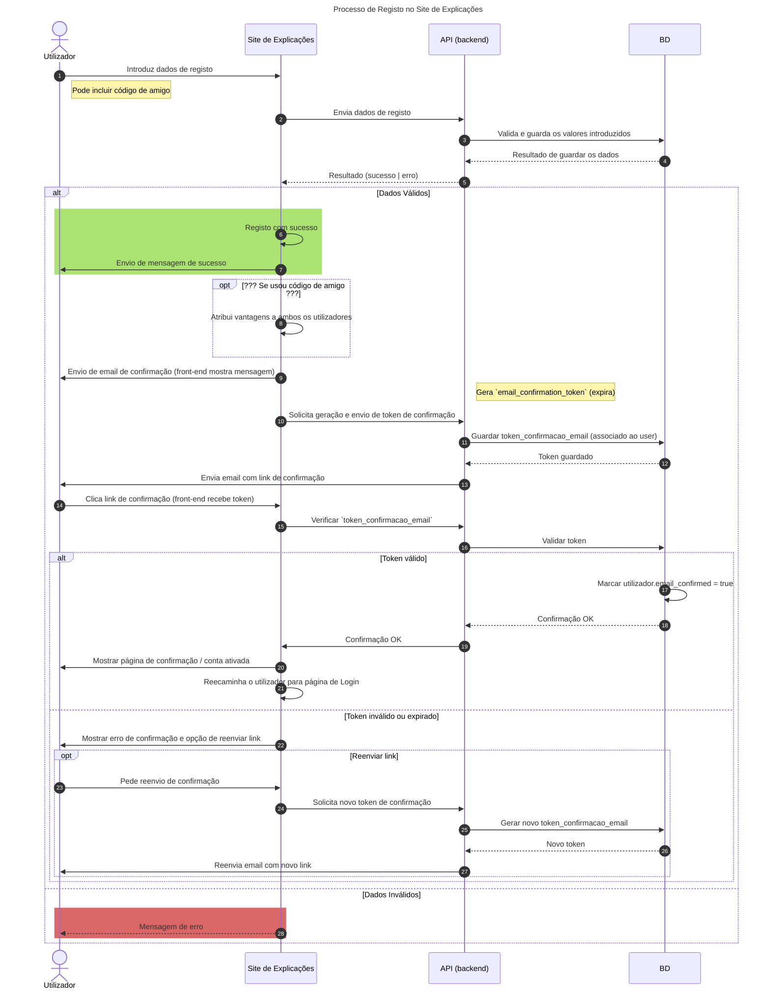

```mermaid
sequenceDiagram
    title Processo de Registo no Site de Explicações
    autonumber
    actor Utilizador
    participant Site as Site de Explicações
    participant API as API (backend)
    participant BD as BD

    Utilizador->>Site: Introduz dados de registo
    Note right of Utilizador: Pode incluir código de amigo
    Site->>API: Envia dados de registo
    API->>BD: Valida e guarda os valores introduzidos
    BD-->>API: Resultado de guardar os dados
    API-->>Site: Resultado (sucesso | erro)

    alt Dados Válidos
        rect rgba(170,227,113,1)
            Site->>Site: Registo com sucesso
            Site->>Utilizador: Envio de mensagem de sucesso
        end
        opt ??? Se usou código de amigo ???
            Site->>Site: Atribui vantagens a ambos os utilizadores
        end
        Site->>Utilizador: Envio de email de confirmação (front-end mostra mensagem)
        Note right of API: Gera `email_confirmation_token` (expira)
        Site->>API: Solicita geração e envio de token de confirmação
        API->>BD: Guardar token_confirmacao_email (associado ao user)
        BD-->>API: Token guardado
        API->>Utilizador: Envia email com link de confirmação

        %% Fluxo de confirmação por email
        Utilizador->>Site: Clica link de confirmação (front-end recebe token)
        Site->>API: Verificar `token_confirmacao_email`
        API->>BD: Validar token
        alt Token válido
            BD->>BD: Marcar utilizador.email_confirmed = true
            BD-->>API: Confirmação OK
            API->>Site: Confirmação OK
            Site->>Utilizador: Mostrar página de confirmação / conta ativada
            Site->>Site: Reecaminha o utilizador para página de Login
        else Token inválido ou expirado
            Site->>Utilizador: Mostrar erro de confirmação e opção de reenviar link
            opt Reenviar link
                Utilizador->>Site: Pede reenvio de confirmação
                Site->>API: Solicita novo token de confirmação
                API->>BD: Gerar novo token_confirmacao_email
                BD-->>API: Novo token
                API->>Utilizador: Reenvia email com novo link
            end
        end

    else Dados Inválidos
        rect rgba(219,102,102,1)
            Site-->>Utilizador: Mensagem de erro
        end
    end
```