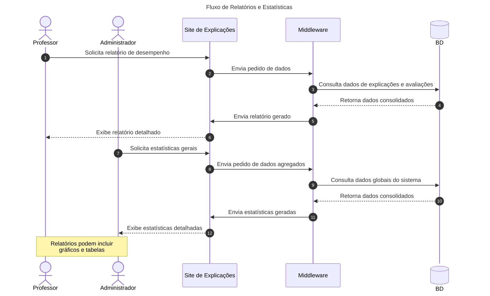

```mermaid
sequenceDiagram
    actor Professor
    actor Administrador
    participant Site as Site de Explicações
    participant Mid as Middleware
    participant BD@{ "type": "database" }
    autonumber

    title Fluxo de Relatórios e Estatísticas

    Professor->>Site: Solicita relatório de desempenho
    Site->>Mid: Envia pedido de dados
    Mid->>BD: Consulta dados de explicações e avaliações
    BD-->>Mid: Retorna dados consolidados
    Mid->>Site: Envia relatório gerado
    Site-->>Professor: Exibe relatório detalhado

    Administrador->>Site: Solicita estatísticas gerais
    Site->>Mid: Envia pedido de dados agregados
    Mid->>BD: Consulta dados globais do sistema
    BD-->>Mid: Retorna dados consolidados
    Mid->>Site: Envia estatísticas geradas
    Site-->>Administrador: Exibe estatísticas detalhadas

    Note over Professor, Administrador: Relatórios podem incluir <br/> gráficos e tabelas
```