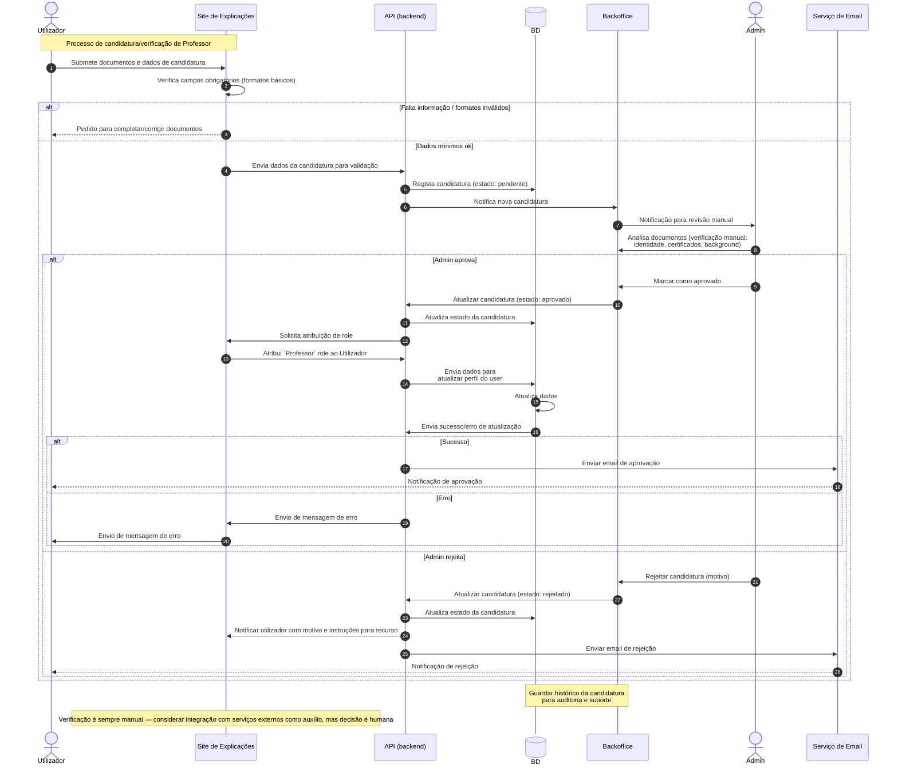

```mermaid
---
config:
  sequence:
    actorFontSize: 18
    noteFontSize: 40
    messageFontSize: 26
---
sequenceDiagram
    autonumber
    actor Utilizador
    participant Site as Site de Explicações
    participant API as API (backend)
    participant BD@{ "type": "database" }
    participant BO as Backoffice
    actor Admin
    participant Email as Serviço de Email

    Note over Utilizador,Site: Processo de candidatura/verificação de Professor
    Utilizador->>Site: Submete documentos e dados de candidatura
    Site->>Site: Verifica campos obrigatórios (formatos básicos)
    alt Falta informação / formatos inválidos
        Site-->>Utilizador: Pedido para completar/corrigir documentos
    else Dados mínimos ok
        Site->>API: Envia dados da candidatura para validação
        API->>BD: Regista candidatura (estado: pendente)
        API->>BO: Notifica nova candidatura
        BO->>Admin: Notificação para revisão manual
        Admin->>BO: Analisa documentos (verificação manual: <br/> identidade, certificados, background)

        alt Admin aprova
            Admin->>BO: Marcar como aprovado
            BO->>API: Atualizar candidatura (estado: aprovado)
            API->>BD: Atualiza estado da candidatura
            API->>Site: Solicita atribuição de role
            Site->>API: Atribui `Professor` role ao Utilizador
            API->>BD: Envia dados para <br/> atualizar perfil do user
            BD->>BD:Atualiza dados
            BD->>API:Envia sucesso/erro de atualização
            alt Sucesso
                API->>Email: Enviar email de aprovação
                Email-->>Utilizador: Notificação de aprovação
            else Erro
                API->>Site:Envio de mensagem de erro
                Site->>Utilizador: Envio de mensagem de erro
            end
            
        else Admin rejeita
            Admin->>BO: Rejeitar candidatura (motivo)
            BO->>API: Atualizar candidatura (estado: rejeitado)
            API->>BD: Atualiza estado da candidatura
            API->>Site: Notificar utilizador com motivo e instruções para recurso
            API->>Email: Enviar email de rejeição
            Email-->>Utilizador: Notificação de rejeição
        end
    end

    Note over BD,BO: Guardar histórico da candidatura <br/> para auditoria e suporte
    Note over Site: Verificação é sempre manual — considerar integração com serviços externos como auxílio, mas decisão é humana
```