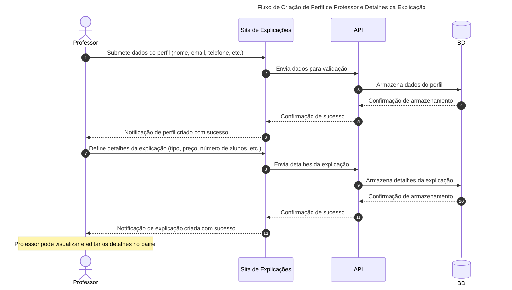

```mermaid
sequenceDiagram
    autonumber
    actor Professor
    participant Site as Site de Explicações
    participant API as API
    participant BD@{ "type": "database" }

    title Fluxo de Criação de Perfil de Professor e Detalhes da Explicação

    Professor->>Site: Submete dados do perfil (nome, email, telefone, etc.)
    Site->>API: Envia dados para validação
    API->>BD: Armazena dados do perfil
    BD-->>API: Confirmação de armazenamento
    API-->>Site: Confirmação de sucesso
    Site-->>Professor: Notificação de perfil criado com sucesso

    Professor->>Site: Define detalhes da explicação (tipo, preço, número de alunos, etc.)
    Site->>API: Envia detalhes da explicação
    API->>BD: Armazena detalhes da explicação
    BD-->>API: Confirmação de armazenamento
    API-->>Site: Confirmação de sucesso
    Site-->>Professor: Notificação de explicação criada com sucesso

    Note over Professor: Professor pode visualizar e editar os detalhes no painel
```