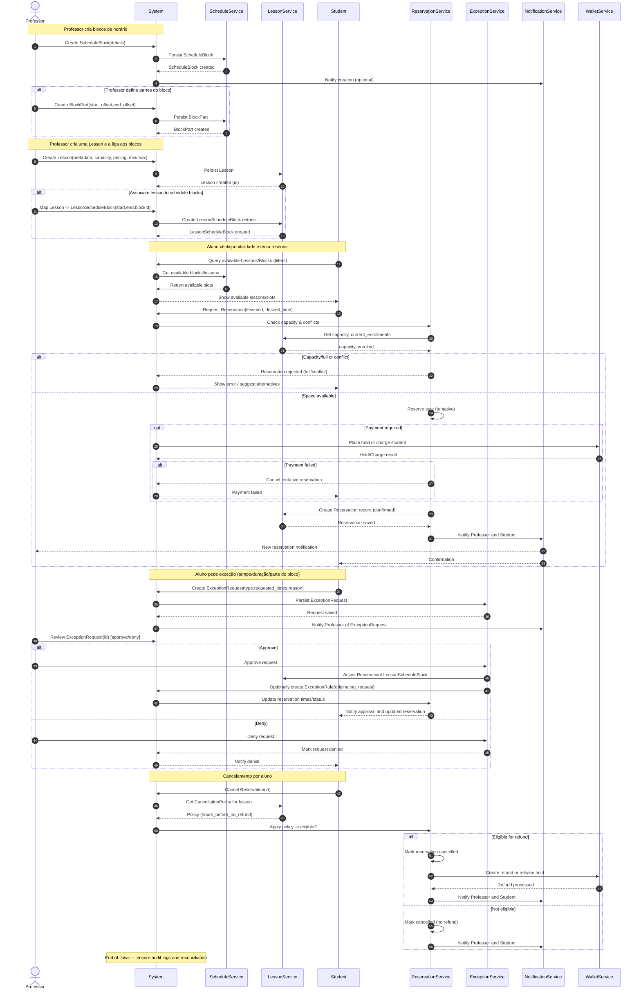

```mermaid
sequenceDiagram
    autonumber
    actor Professor
    participant System
    participant ScheduleService
    participant LessonService
    participant Student
    participant ReservationService
    participant ExceptionService
    participant NotificationService
    participant WalletService

    Note over Professor,System: Professor cria blocos de horário
    Professor->>System: Create ScheduleBlock(details)
    System->>ScheduleService: Persist ScheduleBlock
    ScheduleService-->>System: ScheduleBlock created
    System->>NotificationService: Notify creation (optional)

    alt Professor define partes do bloco
        Professor->>System: Create BlockPart(start_offset,end_offset)
        System->>ScheduleService: Persist BlockPart
        ScheduleService-->>System: BlockPart created
    end

    Note over Professor,System: Professor cria uma Lesson e a liga aos blocos
    Professor->>System: Create Lesson(metadata, capacity, pricing, min/max)
    System->>LessonService: Persist Lesson
    LessonService-->>System: Lesson created (id)
    alt Associate lesson to schedule blocks
        Professor->>System: Map Lesson -> LessonScheduleBlock(start,end,blockId)
        System->>LessonService: Create LessonScheduleBlock entries
        LessonService-->>System: LessonScheduleBlock created
    end

    Note over Student,System: Aluno vê disponibilidade e tenta reservar
    Student->>System: Query available Lessons/Blocks (filters)
    System->>ScheduleService: Get available blocks/lessons
    ScheduleService-->>System: Return available slots
    System-->>Student: Show available lessons/slots

    Student->>System: Request Reservation(lessonId, desired_time)
    System->>ReservationService: Check capacity & conflicts
    ReservationService->>LessonService: Get capacity, current_enrollments
    LessonService-->>ReservationService: capacity, enrolled
    alt Capacity/full or conflict
        ReservationService-->>System: Reservation rejected (full/conflict)
        System-->>Student: Show error / suggest alternatives
    else Space available
        ReservationService->>ReservationService: Reserve seat (tentative)
        opt Payment required
            System->>WalletService: Place hold or charge student
            WalletService-->>System: Hold/Charge result
            alt Payment failed
                ReservationService-->>System: Cancel tentative reservation
                System-->>Student: Payment failed
            end
        end
        ReservationService->>LessonService: Create Reservation record (confirmed)
        LessonService-->>ReservationService: Reservation saved
        ReservationService->>NotificationService: Notify Professor and Student
        NotificationService-->>Professor: New reservation notification
        NotificationService-->>Student: Confirmation
    end

    Note over Student,System: Aluno pede exceção (tempo/duração/parte do bloco)
    Student->>System: Create ExceptionRequest(type,requested_times,reason)
    System->>ExceptionService: Persist ExceptionRequest
    ExceptionService-->>System: Request saved
    System->>NotificationService: Notify Professor of ExceptionRequest

    Professor->>System: Review ExceptionRequest(id) [approve/deny]
    alt Approve
        Professor->>ExceptionService: Approve request
        ExceptionService->>LessonService: Adjust Reservation/ LessonScheduleBlock
        ExceptionService->>System: Optionally create ExceptionRule(originating_request)
        System->>ReservationService: Update reservation times/status
        ReservationService-->>Student: Notify approval and updated reservation
    else Deny
        Professor->>ExceptionService: Deny request
        ExceptionService-->>System: Mark request denied
        System-->>Student: Notify denial
    end

    Note over Student,System: Cancelamento por aluno
    Student->>System: Cancel Reservation(id)
    System->>LessonService: Get CancellationPolicy for lesson
    LessonService-->>System: Policy (hours_before_no_refund)
    System->>ReservationService: Apply policy -> eligible?
    alt Eligible for refund
        ReservationService->>ReservationService: Mark reservation cancelled
        ReservationService->>WalletService: Create refund or release hold
        WalletService-->>ReservationService: Refund processed
        ReservationService->>NotificationService: Notify Professor and Student
    else Not eligible
        ReservationService->>ReservationService: Mark cancelled (no refund)
        ReservationService->>NotificationService: Notify Professor and Student
    end

    Note over System: End of flows — ensure audit logs and reconciliation

```
