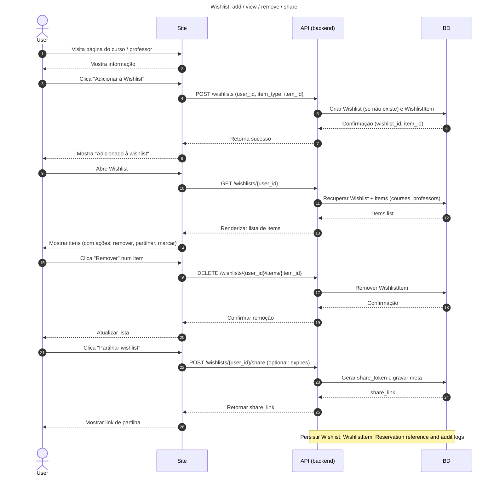

```mermaid
sequenceDiagram
    autonumber
    actor User
    participant Site as Site
    participant API as API (backend)
    participant BD as BD

    title Wishlist: add / view / remove / share

    %% User discovers item and adds to wishlist
    User->>Site: Visita página do curso / professor
    Site-->>User: Mostra informação
    User->>Site: Clica "Adicionar à Wishlist"
    Site->>API: POST /wishlists (user_id, item_type, item_id)
    API->>BD: Criar Wishlist (se não existe) e WishlistItem
    BD-->>API: Confirmação (wishlist_id, item_id)
    API-->>Site: Retorna sucesso
    Site-->>User: Mostra "Adicionado à wishlist"

    %% View wishlist
    User->>Site: Abre Wishlist
    Site->>API: GET /wishlists/{user_id}
    API->>BD: Recuperar Wishlist + items (courses, professors)
    BD-->>API: Items list
    API-->>Site: Renderizar lista de items
    Site-->>User: Mostrar itens (com ações: remover, partilhar, marcar)

    %% Remove item
    User->>Site: Clica "Remover" num item
    Site->>API: DELETE /wishlists/{user_id}/items/{item_id}
    API->>BD: Remover WishlistItem
    BD-->>API: Confirmação
    API-->>Site: Confirmar remoção
    Site-->>User: Atualizar lista

    %% Share wishlist
    User->>Site: Clica "Partilhar wishlist"
    Site->>API: POST /wishlists/{user_id}/share (optional: expires)
    API->>BD: Gerar share_token e gravar meta
    BD-->>API: share_link
    API-->>Site: Retornar share_link
    Site-->>User: Mostrar link de partilha

    Note over API,BD: Persistir Wishlist, WishlistItem, Reservation reference and audit logs
```
