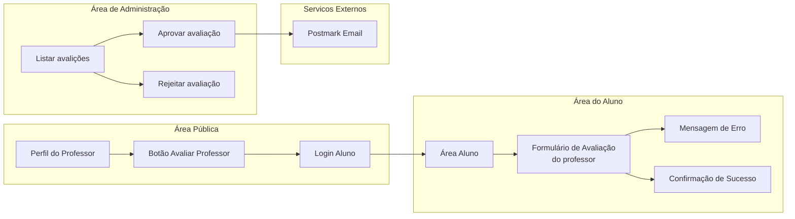
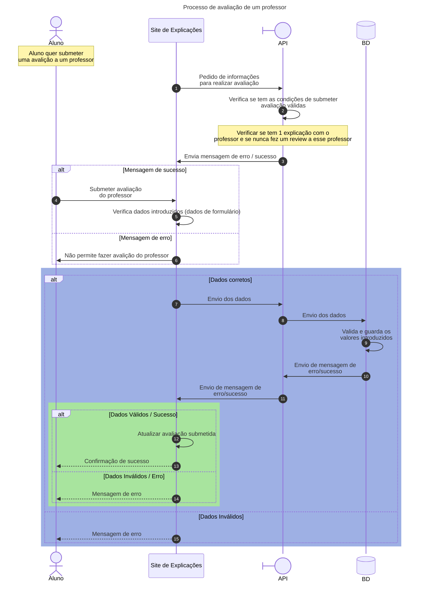

# Processo de Avaliação de Professor
Este documento descreve o processo de avaliação de professores na plataforma de explicações online, tendo como base exclusiva o diagrama de sequência abaixo.

# Diagrama de fluxos - Avaliação de professor

O diagrama de fluxos apresenta uma visão funcional do processo de avaliação de professores, evidenciando as diferentes áreas da aplicação (Área Pública, Área do Aluno, Área de Administração e Serviços Externos) e a forma como o utilizador navega entre elas.
Este diagrama permite compreender:
- O ponto de entrada do utilizador no perfil do professor
- A necessidade de autenticação para submeter uma avaliação
- A submissão e o resultado da avaliação
- O processo de moderação administrativa e envio de notificações por email


# Diagrama de Sequência – Avaliação de Professor

O diagrama de sequência descreve o comportamento dinâmico do sistema, detalhando a interação entre o Aluno, o Site de Explicações, a API e a Base de Dados durante o processo de avaliação.
Este diagrama evidencia:
- A validação das condições necessárias para avaliar um professor
- A submissão e validação dos dados da avaliação
- A persistência da informação na base de dados
- O tratamento de casos de sucesso e erro



# Rotas Necessárias
As rotas apresentadas abaixo são estritamente derivadas dos passos representados nos diagramas, cobrindo apenas as funcionalidades modeladas.


### Rotas Frontend

```dart
// Rotas Frontend em formato Flutter (Dart)
const Map<String, Map<String, dynamic>> frontendRoutes = {
    // Perfil do professor (área pública)
    'professores/{id}': {
        'controller': 'TeacherController',
        'action': 'profile',
    },
    // Início do processo de avaliação (requer login)
    'professores/{id}/avaliar': {
        'controller': 'ReviewController',
        'action': 'create',
        'auth': 'aluno',
    },
    // Submissão do formulário de avaliação
    'professores/{id}/avaliar/submeter': {
        'controller': 'ReviewController',
        'action': 'store',
        'auth': 'aluno',
    },
    // Área do aluno
    'area-aluno': {
        'controller': 'AlunoController',
        'action': 'dashboard',
        'auth': 'aluno',
    },
    // Administração – gestão de avaliações
    'admin/avaliacoes': {
        'controller': 'admin/ReviewController',
        'action': 'index',
        'auth': true,
        'role': 'admin',
    },
    'admin/avaliacoes/{id}/aprovar': {
        'controller': 'admin/ReviewController',
        'action': 'approve',
        'auth': true,
        'role': 'admin',
    },
    'admin/avaliacoes/{id}/rejeitar': {
        'controller': 'admin/ReviewController',
        'action': 'reject',
        'auth': true,
        'role': 'admin',
    },
};
```
### Rotas API
```C
// Verificar se o aluno pode avaliar o professor
GET /api/reviews/can-review/{teacherId}

// Submeter avaliação (Aluno ao professor)
POST /api/reviews

// Listar avaliações (admin)
GET /api/reviews

// Aprovar avaliação (admin)
PUT /api/reviews/{id}/approve

// Rejeitar avaliação (admin)
PUT /api/reviews/{id}/reject
```

### Tabelas necessárias para avaliação de professor
As tabelas abaixo são essenciais para suportar todas as funcionalidades descritas neste documento (perfil, avaliação, moderação, permissões, notificações, etc):

```sql
-- Users e as suas roles
CREATE TABLE IF NOT EXISTS roles (...);
CREATE TABLE IF NOT EXISTS users (...);

-- Professores e perfil
CREATE TABLE IF NOT EXISTS professors (...);
CREATE TABLE IF NOT EXISTS professor_feedback (...);

-- Menssages
CREATE TABLE IF NOT EXISTS messages (...);

--User profiles
CREATE TABLE IF NOT EXISTS roles (
  id_role INTEGER GENERATED BY DEFAULT AS IDENTITY PRIMARY KEY,
  name VARCHAR(50) NOT NULL,
  description TEXT,
  created_at TIMESTAMP DEFAULT now(),
  updated_at TIMESTAMP DEFAULT now()
);

CREATE TABLE IF NOT EXISTS users (
  id_user INTEGER GENERATED BY DEFAULT AS IDENTITY PRIMARY KEY,
  name VARCHAR(150) NOT NULL,
  email VARCHAR(255) UNIQUE,
  password_hash TEXT,
  cell_phone_number VARCHAR(50),
  email_verified BOOLEAN DEFAULT false,
  created_at TIMESTAMP DEFAULT now(),
  updated_at TIMESTAMP DEFAULT now(),
  id_role INTEGER NOT NULL REFERENCES roles(id_role)
);

-- Avaliações e moderação
CREATE TABLE IF NOT EXISTS professor_feedback (
    id_professor_feedback INTEGER GENERATED BY DEFAULT AS IDENTITY PRIMARY KEY,
    id_professor INTEGER NOT NULL REFERENCES professors(id_professor),
    id_user INTEGER NOT NULL REFERENCES users(id_user),
    is_valid BOOLEAN DEFAULT true,
    rating INTEGER,
    comments TEXT,
    created_at TIMESTAMP DEFAULT now()
);

-- Notificações
CREATE TABLE IF NOT EXISTS notifications (
    id_notification INTEGER GENERATED BY DEFAULT AS IDENTITY PRIMARY KEY,
    id_user INTEGER NOT NULL REFERENCES users(id_user) ON DELETE CASCADE,
    type VARCHAR(50),
    message VARCHAR(500),
    was_read BOOLEAN DEFAULT false,
    created_at TIMESTAMP DEFAULT now(),
    updated_at TIMESTAMP DEFAULT now()
);

--Messages
CREATE TABLE IF NOT EXISTS messages (
  id_message INTEGER GENERATED BY DEFAULT AS IDENTITY PRIMARY KEY,
  sender_user_id INTEGER NOT NULL REFERENCES users(id_user) ON DELETE CASCADE,
  receiver_user_id INTEGER NOT NULL REFERENCES users(id_user) ON DELETE CASCADE,
  message_content TEXT,
  is_read BOOLEAN DEFAULT false,
  sent_at TIMESTAMP DEFAULT now(),
  read_at TIMESTAMP
);


```

> Para detalhes completos de cada tabela, consulte o arquivo `sql/postgres/schema_all.sql`.