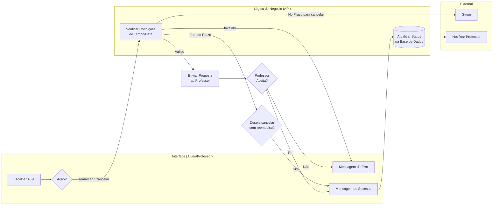
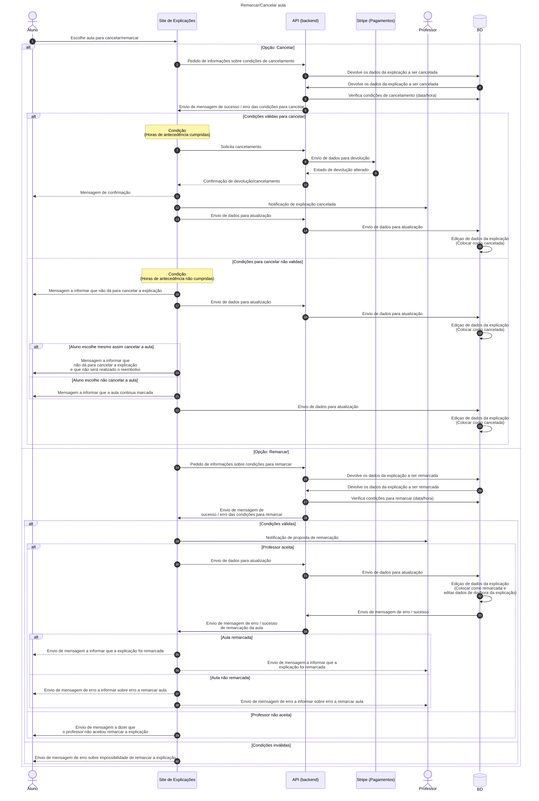

# Processo de Avaliação de Professor
Este documento descreve o processo de avaliação de professores na plataforma de explicações online, tendo como base exclusiva o diagrama de sequência abaixo.

# Diagrama de fluxos - Avaliação de professor

O diagrama de fluxos apresenta uma visão funcional do processo de avaliação de professores, evidenciando as diferentes áreas da aplicação (Área Pública, Área do Aluno, Área de Administração e Serviços Externos) e a forma como o utilizador navega entre elas.
Este diagrama permite compreender:
- O ponto de entrada do utilizador no perfil do professor
- A necessidade de autenticação para submeter uma avaliação
- A submissão e o resultado da avaliação
- O processo de moderação administrativa e envio de notificações por email





# Rotas Necessárias
As rotas apresentadas abaixo são estritamente derivadas dos passos representados nos diagramas, cobrindo todas as funcionalidades e direitos envolvidos (aluno, professor, admin).

### Rotas Frontend
```dart
// Rotas Frontend em formato Flutter (Dart)
const Map<String, Map<String, dynamic>> frontendRoutes = {
    // Cancelar aula (aluno)
    'aulas/{id}/cancelar': {
        'controller': 'LessonController',
        'action': 'cancel',
        'auth': 'aluno',
    },
    // Remarcar aula (aluno)
    'aulas/{id}/remarcar': {
        'controller': 'LessonController',
        'action': 'reschedule',
        'auth': 'aluno',
    },
    // Notificação para professor
    'professor/notificacoes': {
        'controller': 'ProfessorController',
        'action': 'notifications',
        'auth': 'professor',
    },
    // Área do aluno
    'area-aluno': {
        'controller': 'AlunoController',
        'action': 'dashboard',
        'auth': 'aluno',
    },
    // Administração – gestão de aulas
    'admin/aulas': {
        'controller': 'admin/LessonController',
        'action': 'index',
        'auth': true,
        'role': 'admin',
    },
    'admin/aulas/{id}/cancelar': {
        'controller': 'admin/LessonController',
        'action': 'cancel',
        'auth': true,
        'role': 'admin',
    },
    'admin/aulas/{id}/remarcar': {
        'controller': 'admin/LessonController',
        'action': 'reschedule',
        'auth': true,
        'role': 'admin',
    },
};
```

### Rotas API
```C
// Verificar se o aluno pode cancelar/remarcar a aula
GET /api/lessons/can-cancel/{lessonId}
GET /api/lessons/can-reschedule/{lessonId}

// Cancelar aula (aluno)
POST /api/lessons/{id}/cancel

// Remarcar aula (aluno)
POST /api/lessons/{id}/reschedule

// Notificar professor
POST /api/professors/{id}/notify

// Listar aulas (admin)
GET /api/lessons

// Cancelar aula (admin)
PUT /api/lessons/{id}/cancel

// Remarcar aula (admin)
PUT /api/lessons/{id}/reschedule
```

### Tabelas necessárias para cancelar/remarcar explicação
As tabelas abaixo são essenciais para suportar todas as funcionalidades descritas neste documento (aulas, reservas, pagamentos, notificações, permissões, histórico, etc):

```sql
-- Usuários e permissões
CREATE TABLE IF NOT EXISTS roles (...);
CREATE TABLE IF NOT EXISTS users (...);
CREATE TABLE IF NOT EXISTS professors (...);

-- Aulas e agendamentos
CREATE TABLE IF NOT EXISTS lessons (...);
CREATE TABLE IF NOT EXISTS enrollments (...);
CREATE TABLE IF NOT EXISTS reservations (...);
CREATE TABLE IF NOT EXISTS exception_rules (...);
CREATE TABLE IF NOT EXISTS exception_requests (...);

-- Pagamentos e reembolsos
CREATE TABLE IF NOT EXISTS wallets (...);
CREATE TABLE IF NOT EXISTS transactions (...);
CREATE TABLE IF NOT EXISTS refunds (...);

-- Notificações e mensagens
CREATE TABLE IF NOT EXISTS notifications (...);
CREATE TABLE IF NOT EXISTS messages (...);

-- Histórico de alterações (opcional)
-- CREATE TABLE IF NOT EXISTS lesson_history (...);
```

> Para detalhes completos de cada tabela, consulte o arquivo `sql/postgres/schema_all.sql`.