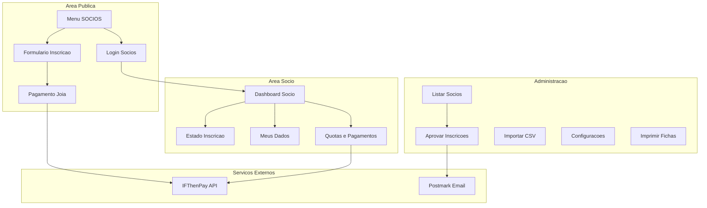
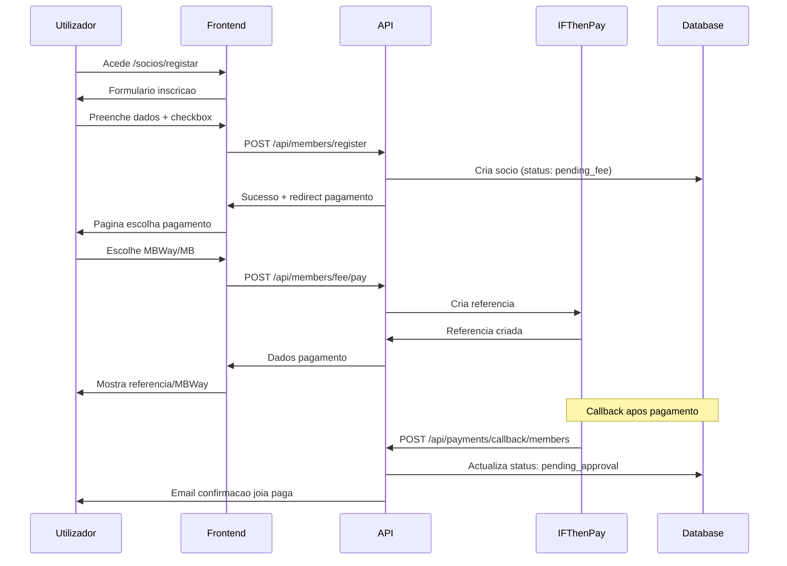
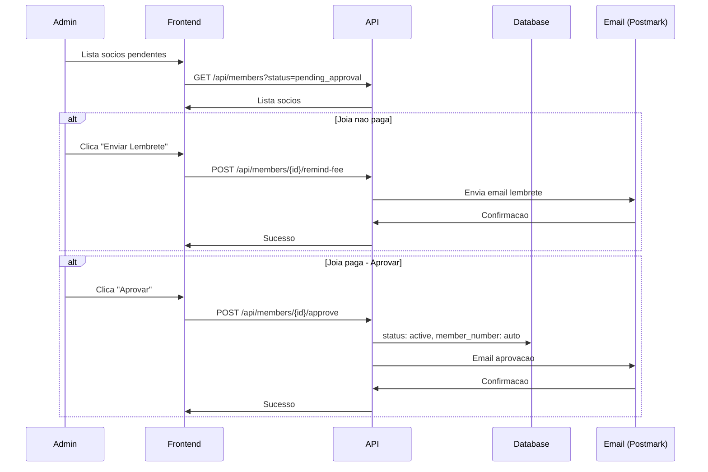

# Sistema de Gestao de Socios ACML

## Arquitectura Geral



## 1. Base de Dados

### Novas Tabelas


*Ficheiro*: docker/mysql/init.sql (adicionar)

```sql
-- Tabela: members (Socios)
CREATE TABLE members (
    id INT PRIMARY KEY AUTO_INCREMENT,
    member_number INT UNIQUE,                    -- Numero de socio (auto ou manual)
    email VARCHAR(255) UNIQUE NOT NULL,
    password_hash VARCHAR(255) NOT NULL,
    full_name VARCHAR(200) NOT NULL,
    address VARCHAR(255) NOT NULL,
    postal_code VARCHAR(10) NOT NULL,
    city VARCHAR(100) NOT NULL,
    birth_date DATE NOT NULL,
    nationality VARCHAR(100) NOT NULL,
    id_card_number VARCHAR(20) NOT NULL,         -- CC
    id_card_expiry DATE NOT NULL,                -- Validade CC
    tax_number VARCHAR(15) NOT NULL,             -- NIF
    phone VARCHAR(20) NOT NULL,
    status ENUM('pending_fee', 'pending_approval', 'active', 'suspended', 'cancelled') 
           DEFAULT 'pending_fee',
    fee_paid_at DATETIME,                        -- Data pagamento joia
    approved_at DATETIME,
    approved_by INT,                             -- staff_id
    created_at TIMESTAMP DEFAULT CURRENT_TIMESTAMP,
    updated_at TIMESTAMP DEFAULT CURRENT_TIMESTAMP ON UPDATE CURRENT_TIMESTAMP,
    FOREIGN KEY (approved_by) REFERENCES staff(id)
);

-- Tabela: member_dues (Quotas)
CREATE TABLE member_dues (
    id INT PRIMARY KEY AUTO_INCREMENT,
    member_id INT NOT NULL,
    year INT NOT NULL,
    amount DECIMAL(10,2) NOT NULL,
    status ENUM('pending', 'paid', 'cancelled') DEFAULT 'pending',
    due_date DATE NOT NULL,
    paid_at DATETIME,
    payment_method ENUM('mbway', 'multibanco', 'cash', 'transfer'),
    created_at TIMESTAMP DEFAULT CURRENT_TIMESTAMP,
    FOREIGN KEY (member_id) REFERENCES members(id),
    UNIQUE KEY unique_member_year (member_id, year)
);

-- Tabela: member_payments (Pagamentos de socios)
CREATE TABLE member_payments (
    id INT PRIMARY KEY AUTO_INCREMENT,
    member_id INT NOT NULL,
    type ENUM('fee', 'due') NOT NULL,            -- joia ou quota
    due_id INT,                                   -- se for quota
    amount DECIMAL(10,2) NOT NULL,
    status ENUM('pending', 'completed', 'failed', 'expired') DEFAULT 'pending',
    payment_method ENUM('mbway', 'multibanco') NOT NULL,
    ifthenpay_reference VARCHAR(255),
    ifthenpay_transaction_id VARCHAR(255),
    expiration_date DATETIME,
    paid_at DATETIME,
    created_at TIMESTAMP DEFAULT CURRENT_TIMESTAMP,
    FOREIGN KEY (member_id) REFERENCES members(id),
    FOREIGN KEY (due_id) REFERENCES member_dues(id)
);

-- Tabela: member_settings (Configuracoes)
CREATE TABLE member_settings (
    id INT PRIMARY KEY AUTO_INCREMENT,
    setting_key VARCHAR(100) UNIQUE NOT NULL,
    setting_value TEXT NOT NULL,
    updated_at TIMESTAMP DEFAULT CURRENT_TIMESTAMP ON UPDATE CURRENT_TIMESTAMP
);

-- Dados iniciais de configuracao
INSERT INTO member_settings (setting_key, setting_value) VALUES
('fee_amount', '25.00'),
('annual_due_amount', '15.00'),
('next_member_number', '1');
```

## 2. API - Novos Endpoints

### Ficheiros a criar em api/includes/

- repositories/MemberRepository.php - Acesso a dados de socios
- repositories/MemberDueRepository.php - Acesso a dados de quotas
- repositories/MemberPaymentRepository.php - Acesso a dados de pagamentos
- repositories/MemberSettingsRepository.php - Configuracoes
- controllers/MemberController.php - CRUD de socios
- controllers/MemberAuthController.php - Autenticacao de socios
- controllers/MemberDueController.php - Gestao de quotas
- controllers/MemberPaymentController.php - Pagamentos
- services/MemberPaymentService.php - Integracao IFThenPay

### Rotas API (api/config/routes.php)

php
// Publicas - Socios
$router->post('/api/members/register', 'MemberController@register');
$router->post('/api/members/auth/login', 'MemberAuthController@login');

// Autenticadas - Socio
$router->group(['middleware' => ['MemberAuthMiddleware']], function($router) {
    $router->get('/api/members/me', 'MemberAuthController@me');
    $router->get('/api/members/me/dues', 'MemberDueController@myDues');
    $router->post('/api/members/me/dues/{id}/pay', 'MemberPaymentController@payDue');
    $router->post('/api/members/fee/pay', 'MemberPaymentController@payFee');
});

// Admin - Gestao de Socios
$router->group(['middleware' => ['AuthMiddleware', 'AdminMiddleware']], function($router) {
    $router->get('/api/members', 'MemberController@index');
    $router->get('/api/members/{id}', 'MemberController@show');
    $router->post('/api/members', 'MemberController@store');
    $router->put('/api/members/{id}', 'MemberController@update');
    $router->post('/api/members/{id}/approve', 'MemberController@approve');
    $router->post('/api/members/{id}/remind-fee', 'MemberController@remindFee');
    $router->post('/api/members/import', 'MemberController@import');
    $router->get('/api/members/settings', 'MemberSettingsController@index');
    $router->put('/api/members/settings', 'MemberSettingsController@update');
    $router->post('/api/members/dues/generate', 'MemberDueController@generateAnnual');
});

// Callback IFThenPay
$router->post('/api/payments/callback/members', 'MemberPaymentController@callback');


## 3. Frontend - Novas Paginas

### Menu Principal

*Ficheiro*: frontend/views/layouts/main.php

Adicionar link "SOCIOS" no menu principal, entre os links existentes:

php
<a href="/socios" class="nav-link nav-link-local">SOCIOS</a>


### Estrutura de Pastas Frontend


frontend/
├── includes/controllers/
│   ├── MemberController.php          # Paginas publicas socios
│   ├── MemberAuthController.php      # Login/registo socios
│   ├── MemberAreaController.php      # Area pessoal socio
│   └── admin/
│       └── MemberController.php      # Admin socios
├── views/
│   ├── members/
│   │   ├── index.php                 # Landing page socios
│   │   ├── register.php              # Formulario inscricao
│   │   ├── payment.php               # Pagamento joia
│   │   ├── payment-success.php       # Confirmacao pagamento
│   │   └── login.php                 # Login socios
│   ├── member-area/
│   │   ├── dashboard.php             # Dashboard socio
│   │   ├── status.php                # Estado inscricao (candidatos)
│   │   ├── profile.php               # Meus dados
│   │   ├── dues.php                  # Quotas e historico
│   │   └── pay-due.php               # Pagar quota
│   └── admin/
│       └── members/
│           ├── index.php             # Lista socios
│           ├── create.php            # Criar socio
│           ├── edit.php              # Editar socio
│           ├── import.php            # Importar CSV
│           ├── print.php             # Imprimir ficha
│           ├── settings.php          # Configuracoes
│           └── dues.php              # Gestao quotas


## 4. Fluxo de Inscricao



## 5. Fluxo de Aprovacao



## 6. Emails

### Templates a criar

- email_member_fee_reminder.php - Lembrete pagamento joia
- email_member_approved.php - Aprovacao de socio
- email_member_due_reminder.php - Lembrete quota (futuro)

## 7. Rotas Frontend

*Ficheiro*: frontend/index.php

php
// Socios - Publico
'socios' => ['controller' => 'MemberController', 'action' => 'index'],
'socios/registar' => ['controller' => 'MemberAuthController', 'action' => 'registerForm'],
'socios/registar/submit' => ['controller' => 'MemberAuthController', 'action' => 'register'],
'socios/login' => ['controller' => 'MemberAuthController', 'action' => 'loginForm'],
'socios/login/submit' => ['controller' => 'MemberAuthController', 'action' => 'login'],
'socios/pagamento-joia' => ['controller' => 'MemberController', 'action' => 'feePayment'],
'socios/pagamento-joia/submit' => ['controller' => 'MemberController', 'action' => 'processFeePayment'],

// Area Socio (autenticado)
'minha-area-socio' => ['controller' => 'MemberAreaController', 'action' => 'dashboard', 'auth' => 'member'],
'minha-area-socio/dados' => ['controller' => 'MemberAreaController', 'action' => 'profile', 'auth' => 'member'],
'minha-area-socio/quotas' => ['controller' => 'MemberAreaController', 'action' => 'dues', 'auth' => 'member'],
'minha-area-socio/quotas/{id}/pagar' => ['controller' => 'MemberAreaController', 'action' => 'payDue', 'auth' => 'member'],

// Admin - Socios
'admin/socios' => ['controller' => 'admin/MemberController', 'action' => 'index', 'auth' => true, 'role' => 'admin'],
'admin/socios/criar' => ['controller' => 'admin/MemberController', 'action' => 'create', 'auth' => true, 'role' => 'admin'],
'admin/socios/{id}' => ['controller' => 'admin/MemberController', 'action' => 'edit', 'auth' => true, 'role' => 'admin'],
'admin/socios/{id}/aprovar' => ['controller' => 'admin/MemberController', 'action' => 'approve', 'auth' => true, 'role' => 'admin'],
'admin/socios/{id}/lembrete' => ['controller' => 'admin/MemberController', 'action' => 'remindFee', 'auth' => true, 'role' => 'admin'],
'admin/socios/{id}/ficha' => ['controller' => 'admin/MemberController', 'action' => 'printCard', 'auth' => true, 'role' => 'admin'],
'admin/socios/importar' => ['controller' => 'admin/MemberController', 'action' => 'import', 'auth' => true, 'role' => 'admin'],
'admin/socios/configuracoes' => ['controller' => 'admin/MemberController', 'action' => 'settings', 'auth' => true, 'role' => 'admin'],
'admin/socios/quotas' => ['controller' => 'admin/MemberController', 'action' => 'dues', 'auth' => true, 'role' => 'admin'],
'admin/socios/quotas/gerar' => ['controller' => 'admin/MemberController', 'action' => 'generateDues', 'auth' => true, 'role' => 'admin'],


## 8. Validacoes Importantes

- *Validade CC*: Data deve ser >= data actual
- *NIF*: Validar formato portugues (9 digitos)
- *Email*: Unico na tabela members
- *Numero socio*: Automatico = MAX(member_number) + 1 ou valor de member_settings
- *Aprovacao*: So permitida se fee_paid_at != NULL

## 9. Importacao CSV

Formato esperado:

csv
numero_socio,nome_completo,email,morada,codigo_postal,localidade,data_nascimento,nacionalidade,cc,validade_cc,nif,telefone,estado
1,Joao Silva,joao@email.pt,Rua X,4000-001,Porto,1990-01-15,Portuguesa,12345678,2030-01-01,123456789,912345678,active


## Prioridade de Implementacao

1. Base de dados (tabelas + seeds)
2. API - Repositories e Controllers
3. Frontend - Inscricao e pagamento joia
4. Frontend - Login e area socio
5. Admin - Listagem e aprovacao
6. Admin - Importacao CSV
7. Admin - Gestao de quotas
8. Emails (Postmark)